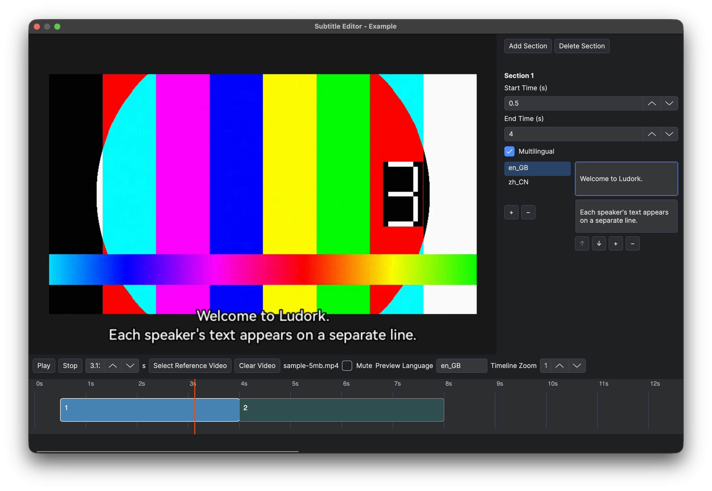

# Video Subtitles

Create a subtitle document in the project file explorer under `Data/Subtitles`, or double-click an existing subtitle JSON file to open its editor. Subdirectories are supported. Subtitle documents use the normal Save, Undo/Redo, unsaved-change and close-confirmation workflow.

## Edit and preview

The upper-left area previews the picture and subtitles, the upper-right area edits the selected section, and the timeline spans the bottom. Select a section by its array position; sections have no separate name or identifier.



Add, select, delete or move sections on the timeline, and drag their edges to adjust their duration. Zoom the timeline and drag the playhead to inspect a time. The properties pane also accepts precise start and end times in seconds. Save orders sections by start time and rejects invalid times or overlapping sections.

Each section has a multilingual switch, off by default for new sections. Turning it on places the existing text under `en_GB` and adds the document's other languages with empty text. Turning it off retains the selected language, with confirmation before discarding other translations from that section.

All multilingual sections share the same language keys. Use `+` and `−` below the language list to add or delete a language throughout the document, or right-click a language to rename it. Names must be nonempty and unique; new languages start with empty text.

Within a section, all languages have the same number of text rows; different sections can have different counts. Click or focus a row, then use `↑`, `↓`, `+` and `−` below the text list to move it, append an empty row or delete it across that section's languages. Typing changes only the selected translation. Switching languages keeps the row selection; switching sections selects the first row. Empty text lists and language lists are allowed, with text operations disabled when no language exists.

When opening existing data, the editor combines the language keys and pads missing languages or shorter arrays to each section's longest array with empty strings, preserving existing text. This is one unsaved, undoable change. Undo restores the original data; padding runs again only with the next content edit and shares that edit's undo step.

Use Play/Pause, Stop, the current time and preview language to check timing. Without a reference video, playback uses a plain background and ends at the last section's end time. An empty subtitle document remains editable.

Choose a project video for temporary reference, or clear it to return to the plain background. Video preserves its aspect ratio and plays synchronised audio, with a mute control. Seeking pauses audio and restores the previous playback state when positioning finishes. Preview duration is the longer of the video and subtitle durations; after video ends, remaining subtitles appear on the plain background. A project without FFmpeg reports that it is not an FFmpeg project when a video is selected; subtitle editing and plain-background preview remain available.

The reference video, preview language, playhead and mute setting belong to the window session and are not saved in the subtitle document.

## Data format

Store UTF-8 JSON beneath `Data/Subtitles` and reference it with a project-relative, case-sensitive `Data/Subtitles/...json` path. Loose files and entries in `Data.ldpak` use the same paths. Encrypted `.ldc` data is resolved through the same `.json` reference. Paths must stay beneath `Data/Subtitles`; absolute paths and directory traversal are invalid. A subtitle document has `type: "subtitle"` and a `sections` array:

```json
{
  "type": "subtitle",
  "sections": [
    {
      "startTime": 0.5,
      "endTime": 3.0,
      "content": {
        "en_GB": ["Speaker 1's content", "Speaker 2's content"],
        "zh_CN": ["角色一的内容", "角色二的内容"]
      }
    },
    {
      "startTime": 3.0,
      "endTime": 5.5,
      "content": ["Content shared by all languages"]
    }
  ]
}
```

Times are finite numbers in seconds with `0 ≤ startTime < endTime`. A section is active from its start time, inclusive, to its end time, exclusive. Sections may touch but cannot overlap; gaps display no subtitles. An empty `sections` array is valid.

`content` is either a string array used directly or a dictionary of language keys to string arrays. The dictionary first selects the current game language, then `en_GB` if that key is missing. If neither exists, no subtitle is displayed. An existing empty array explicitly displays nothing and does not fall back. Native C++ represents these alternatives as `std::variant<std::vector<std::string>, std::unordered_map<std::string, std::vector<std::string>>>`.

## Playback and layout

Pass the subtitle path as the optional fourth argument of [Video.PlayVideo](<../03.Lua and Blueprint Scripting/06.Node Functions/13.Video.md>). Missing or empty paths keep video-only playback. A specified resource must load and validate successfully; malformed subtitle documents report an error.

Subtitles follow the video's playback clock and disappear when playback ends or is skipped. The renderer uses the game's default font and size, with white text and a black outline. Strings appear from top to bottom in array order, wrap as needed and centre each visual line horizontally. The block sits at the bottom of the logical viewport, leaving 5% on each side and 3% below it. Content taller than the available area scales down uniformly to fit. Runtime playback and native editor preview share the subtitle layout.

## Related pages

- [GlobalFunctions.Video](<../03.Lua and Blueprint Scripting/06.Node Functions/13.Video.md>)
- [Project Settings and Asset Layout](<02.Project Settings and Asset Layout.md>)
- [Resources, Audio, Video and Effects](<../03.Lua and Blueprint Scripting/05.Default Gameplay/05.Resources, Audio, Video and Effects.md>)
