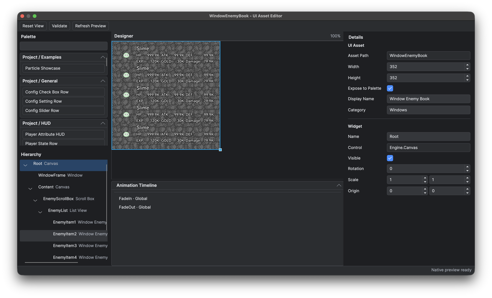

# UI Asset Editor

The UI Asset Editor lays out a declarative UI asset visually, with the Palette, Hierarchy, Designer, Inspector and Timeline in one window. Use it for any screen, window or reusable part that is authored by hand rather than built entirely from code.

## Goal

Create and arrange a declarative UI asset without writing its runtime Controller.

## Prerequisites

- Planned asset ownership: complete UI, owner-specific part or shared part.

## Open or create an asset

Choose **Game → New UI Asset**, or create and open the JSON asset beneath `Data/UI/Assets` through the project file explorer. Asset ownership (`Parts/<Owner>` versus `Shared`) is described in [Declarative UI Authoring Workflow](<../Lua and Blueprint Scripting/Declarative UI/Authoring Workflow.md>).

*The UI Asset Editor separates available controls, tree structure, visual placement and selected-node properties.*

## Steps

1. Set the design width and height for the asset.
2. Add a root control. A new screen normally starts with `Engine.Canvas`.
3. Drag system controls or exposed project assets from the Palette into the Hierarchy. [UI Controls in the Palette](<UI Controls in the Palette.md>) says what each control is for and helps you choose between them.
4. Select each node and edit control properties in the Inspector.
5. Configure the child Slot. Whether a container accepts children at all, and which Slot it supplies, is fixed by its `childPolicy` and `slotType`; the table is in [Children and Slots](<UI Controls in the Palette.md#children-and-slots>). Canvas children use anchors, offsets, alignment, auto-size and z-order, while List children use list-owned placement.
6. Give every node a meaningful name that is unique within the asset. Generated Views preserve these names as typed control or child-View keys.
7. Set **Exposed** only when the asset is a complete, reusable item intended to appear in the Project Palette.
8. Save and review the validation results, then use the main window's **Export** action to generate the Lua View and declarations.

Drag a Palette control onto the middle of a container's Hierarchy row to add a child, or onto the top or bottom quarter of a row to insert a sibling. Dropping in blank Hierarchy space appends to the root. Double-clicking a Palette control also adds it using the current selection.

Adding, duplicating and moving nodes respect the destination's child policy. Moving to a Canvas keeps the visual position and fixed dimensions, retaining Canvas anchors, alignment, auto-size and z-order. Stretched axes follow the new parent's available size. Auto-sized controls and List placement follow native layout; authored rotation and scale are retained, so a differently transformed parent can change orientation or intrinsic text size. Reordering within one parent preserves the entire Slot. Reparenting and its Slot adjustment form one Undo step, including indent and outdent actions. Nested project assets remain black boxes. Validation checks the current asset and its reachable nesting cycles, including cycles inside dependencies.

An `Engine.Button` exposes `gamepadButton` and `gamepadLongPress` in the Inspector. Unbound stores an empty string. Its purpose and remaining Palette properties are in [Engine.Button](<UI Controls in the Palette.md#enginebutton>), and runtime behaviour is in [Engine: Runtime Values and Functional Controls](<../Lua and Blueprint Scripting/Global and Core Modules/Core Modules/Engine/Runtime Values and Functional Controls.md#button>).

Image and FunctionalImage expose **Draw As** as an enum selector: **Image** stretches the picture, while **Tile** repeats its texture region to fill the layout area. WrapBox exposes `size`, `count` and `spacing`, and accepts at most one child template. The Designer shows every repetition; selecting and editing any repetition changes the same template, and saving retains only that authored child. Purpose and the remaining properties are in [Engine.Image](<UI Controls in the Palette.md#engineimage>), [Engine.FunctionalImage](<UI Controls in the Palette.md#enginefunctionalimage>) and [Engine.WrapBox](<UI Controls in the Palette.md#enginewrapbox>); see [Engine: Layout and Image Controls](<../Lua and Blueprint Scripting/Global and Core Modules/Core Modules/Engine/Layout and Image Controls.md>) for scaling and runtime access.

## Timeline

The Timeline lists animations on the left and starts with no selection, an empty detail area and the authored UI appearance. Right-click to add or delete a local animation, then select one to edit its name, target, duration, pivot, tracks and keys. Clicking blank list space clears the selection. Colour keys use integer RGBA components.

Play, pause, stop and scrub use the game animation runtime. Preview sampling does not write presentation transforms back into the Slot.

A nested project node lists the Global animations inherited from its asset. Use the override action to create a same-name animation targeted at this instance, and then edit it locally, because inherited definitions themselves remain read-only.

## Asset paths and node names

The asset identity is the exact-case path relative to `Data/UI/Assets`, with forward slashes and no extension. Moving or renaming an asset rewrites managed JSON nesting references. The next Export regenerates its View and declarations, so update handwritten `require` paths and references to renamed nodes before exporting. The full key contract is in [UI Asset Schema and Control Registry](<../Lua and Blueprint Scripting/Declarative UI/Asset Schema and Control Registry.md>).

## Preview behaviour

The Designer uses the compiled preview runtime of the project. Use **Construct** after C++ UI changes, because previews are unavailable during the build and refresh only when matching artifacts are ready. Setup and validation requirements are in [Declarative UI Validation and Packaging](<../Lua and Blueprint Scripting/Declarative UI/Validation and Packaging.md>).

Each editor window has its own preview session. Rapid field edits are combined into a refresh, and **Refresh Preview** submits pending field edits and requests the latest state. Canvas dragging and resizing render continuously, combining pointer updates while a frame is in flight; each gesture remains one Undo step. Releasing or cancelling a drag requests its final state immediately. Animation playback samples continue as rendering completes. Results from an earlier edit, completed gesture, animation selection, zoom or runtime build cannot replace the current preview. Closing a window stops playback and releases its preview connection.

Saved JSON keeps Chinese text readable and still escapes special characters such as quotes and backslashes.

Preview instantiates the asset tree without its Lua Controller, so top-level assets contain every visible pane and representative placeholders. `previewText` and `editor` data are design-only, and business code populates runtime content before display.

## Limitations

- The Designer shows the asset tree without its Controller, so anything business code supplies at runtime is absent. Author representative placeholders and use `previewText` for text.
- The preview runtime is unavailable while native UI is building; a C++ change needs **Construct** before the Designer can show it.
- A nested project asset cannot be overridden or expanded from the parent. Its node carries no internal overrides and no children, and its inherited Global animations stay read-only until you add a same-name override.
- Generated references stop at a WrapBox template boundary, so repeated instances are reachable only through its 1-based `get(i)`.
- Renaming an asset or node rewrites managed JSON references only. Handwritten `require` paths and code references to renamed nodes break until you update them, and the next Export regenerates the View and declarations.
- Validation covers the open asset and the nesting cycles reachable from it, including cycles inside its dependencies. It does not validate unrelated assets.

## Related pages

- [UI Controls in the Palette](<UI Controls in the Palette.md>)
- [Declarative UI Authoring Workflow](<../Lua and Blueprint Scripting/Declarative UI/Authoring Workflow.md>)
- [Declarative UI Controller Examples](<../Lua and Blueprint Scripting/Declarative UI/Controller Examples.md>)
- [UI Asset Schema and Control Registry](<../Lua and Blueprint Scripting/Declarative UI/Asset Schema and Control Registry.md>)
- [Declarative UI Validation and Packaging](<../Lua and Blueprint Scripting/Declarative UI/Validation and Packaging.md>)
