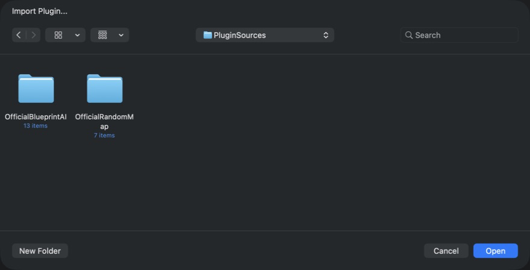
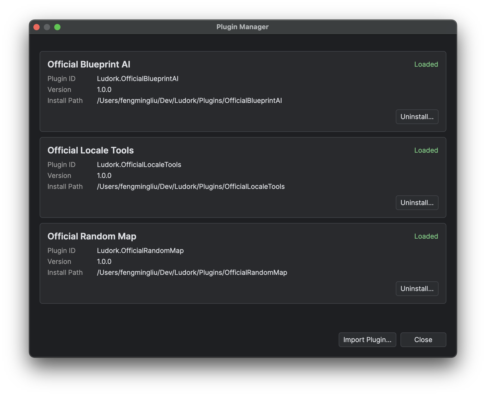

# Installing and Managing Plug-ins

## Goal

Create a source plug-in or import one for all projects or the current project. Inspect, update and uninstall plug-ins while keeping their program files separate from retained writable data.

## Prerequisites

- A copy of any plug-in data that must be preserved independently.

Editor plug-ins are trusted code. They run with the permissions of the editor process and are not sandboxed. Import only directories whose source is trusted.

The plug-in owns its source, windows, labels, settings, retained data and third-party notices. The host owns registration, life cycle, command contexts, the restricted map, Blueprint and resource-cleanup bridges, and operation sequencing.

The API exposes six registration methods: ordinary menu commands, map-item context-menu commands, text hint providers, before-Export hooks, before-Run hooks and before-Pack hooks. Docked panels, toolbars, arbitrary host controls, data types and general editor events have no public registration. Runtime extension belongs in native C++ development, not in editor plug-ins. See [Build and Module Layout](<../Native C++ Development/Build and Module Layout.md>).

## Create a plug-in

1. Open **Plugins → Manage Plugins** and choose **New Plugin...**.
2. Enter a display name and unique plug-in ID. Choose **With a Window** or **Logic Only**; **With a Window** is selected initially.
3. Choose **Global Plugins** or **Current Project Plugins**. An open project defaults to **Current Project Plugins**; the start page allows only **Global Plugins**.
4. Create the plug-in. The editor generates and compiles the template, validates its entry type, then installs and registers it. An error leaves no partially created plug-in or overwritten directory.
5. The source folder opens automatically. Edit the generated files, then restart Ludork to load your changes.

Both templates leave `Register` empty. **With a Window** adds an empty Avalonia window, but does not register a menu or open it automatically. See [Manifest and Minimal Plug-in](<Manifest and Minimal Plug-in.md>) for the generated layout and a complete hand-written command example.

## Import a third-party plug-in

1. Close any work that must not be exposed to the selected code, then inspect the plug-in's source, manifest and origin.
2. Choose **Plugins → Import Plugin** or **Import Plugin** in the manager. Select **Global Plugins** or **Current Project Plugins** when a project is open, then select the complete source directory and accept the trust confirmation. The default scope is the current project; the start page imports globally.
3. Read the import result. Resolve any manifest or compilation error before continuing.
4. Restart Ludork. Imported source is not hot-loaded.
5. Open **Plugins → Manage Plugins** and confirm that the plug-in reports **Loaded** in its scope. Open the target project first for a project plug-in.



*Select the directory containing `plugin.json`, not an individual source file or build output.*

The editor validates the directory and its manifest, creates a safe staging copy below the managed plug-in root, compiles that copy dynamically with Roslyn, and validates the entry type. The copy moves into place and is registered for the next restart only after those checks succeed. The selected directory name is preserved. Compilation failures, duplicate IDs within the effective global-plus-project set and an existing target directory are rejected. `__ProjectPlugins` is reserved for host management and cannot be imported as an ordinary plug-in directory.

The directory must contain `plugin.json` and at least one participating `.cs` source file. Inaccessible paths, links (including broken links), reparse points, embedded `.data`, host-shared DLLs, F# or VB projects, and loose Avalonia XAML source are rejected before installation. A C# project file may remain for IDE use, but the plug-in compiler does not execute it. Sources below `bin`, `obj`, `.git` and `.vs` are ignored.

## Global and project storage

An editor build produced in a repository checkout carries an explicit development marker and uses `./Plugins` as its plug-in root and `./plugins.json` as its registry. A published Windows editor derives its root from the installation directory that contains the `Ludork.exe` launcher. Its plug-in source is below `<installation-root>/Plugins`, and `<installation-root>/plugins.json` is its registry. The editor itself and its dependencies are under `Binaries`. Starting the editor directly still uses the same installation root. A published macOS editor uses `~/Ludork/Plugins`, with its registry at `~/Ludork/plugins.json`. Published outputs omit the development marker even when the publish directory is inside a checkout. Windows does not fall back to, or merge with, `~/Ludork`.

The Windows installation root must remain writable, because `Ludork.ini`, registry updates and `Plugins/.data` are stored there. The per-user MSI location below `%LocalAppData%\Ludork` satisfies this requirement. A portable copy on read-only media does not support plug-in management or writable plug-in data.

Project plug-ins live below the same plug-in root:

```text
Plugins/__ProjectPlugins/<project-key>/
├── plugins.json
├── .data/<plugin-id>/
└── <plugin-directory>/
    ├── plugin.json
    └── Plugin.cs
```

`<project-key>` is `<safe-project-name>-<path-hash>`: the project directory name is made safe and limited to 48 characters; the hash is the first 16 lowercase hexadecimal digits of the SHA-256 of its normalised absolute path. Windows normalises the path to uppercase before hashing. Projects with the same name at different paths remain independent. Newly created plug-in directories use the plug-in ID; imported directories retain their original name.

Each project scope has its own registry and data. The manager groups **Global Plugins** and **Current Project Plugins** separately, including their status and diagnostics. Project plug-ins apply only to that project's menus, map context menus, text hints and operation hooks. Moving or renaming a project directory creates a new scope: import its plug-ins into the new scope to use them again. There is no automatic migration.

## Official release plug-ins

Official Blueprint AI, Official Locale Tools, Official Random Map and [Official Resource Cleanup](<Official Plug-ins/Resource Cleanup.md>) are global plug-ins distributed with the editor. Project plug-ins are not included in official editor distributions. The Windows distribution installs all four below the installation root's `Plugins` folder and includes a `plugins.json` generated from their manifests. They are already registered and enabled, so a release installation does not show the third-party trust confirmation.

The macOS DMG keeps plug-ins outside `Ludork.app`. Finder displays `Ludork.app`, an `Applications` link and **Install Official Plugins**. The `.command` extension of the installer and the plug-in payload are hidden. Drag the app to Applications, keep Ludork closed, then double-click the installer. After the user accepts its explicit warning, the installer validates the hidden payload and transactionally replaces `~/Ludork/Plugins` and `~/Ludork/plugins.json` as one installation.

Do not drag plug-in files to Applications. This macOS operation replaces the complete plug-in installation rather than merging with it. An ordinary failure rolls back to the previous installation. If the rollback itself cannot finish, follow the recovery details shown by the installer. Success does not retain a backup, and it deletes all existing third-party plug-in source, registrations and `Plugins/.data`, as well as all project plug-ins, their registries and data under `Plugins/__ProjectPlugins`. Preserve anything needed before selecting **Replace and Install**. The app and the installer remain unsigned and unnotarised.

## Restart and status

Creation and import compile source before registration. Global plug-ins compile and load at editor startup. Each project’s plug-ins compile and load before its first project window opens in that editor session, and that result is reused when reopening or switching projects. Creating, importing, uninstalling or directly editing plug-in source requires a restart; reopening a project does not reload it. **Plugins → Manage Plugins** reports the Loaded, manifest-invalid, compile-failed, initialisation-failed and pending restart or deletion states, together with diagnostics.

A registered plug-in is enabled after restart, when its scope loads, and there is no hot enable or disable switch. Treat **Loaded** as the effective enabled state.



*Use the status and diagnostics shown here before replacing or removing installed source.*

## Data and uninstall

Global plug-in writable state belongs in `Plugins/.data/<plugin-id>`, which the plug-in obtains from `PluginDataDirectory`. In a repository checkout that path is `./Plugins/.data/<plugin-id>`. In a published Windows editor it is `<installation-root>/Plugins/.data/<plugin-id>`, and in a published macOS editor it is `~/Ludork/Plugins/.data/<plugin-id>`. Official Blueprint AI therefore uses `Plugins/.data/Ludork.OfficialBlueprintAI` below the applicable root. Project plug-in data instead resides in `Plugins/__ProjectPlugins/<project-key>/.data/<plugin-id>`. The same plug-in ID in different project scopes has independent data and credentials. Always use `PluginDataDirectory` rather than writing settings or history into the plug-in source directory.

Uninstall unregisters the plug-in and can schedule safe deletion of its installed files. A loaded directory may remain present until the restart, because its assembly is active. A plug-in that was unregistered without deletion can be registered again by selecting its existing immediate child directory under the same scope’s plug-in root. Plug-in data is retained in both uninstall modes, and deleting that data is a separate explicit operation. Do not edit the registry by hand while the editor is running.

Resource Cleanup's project-specific additional keep list is managed by its host bridge in `EditorCache/ResourceCleanupKeep.list`. It belongs to the project and is separate from both plug-in program content and `PluginDataDirectory`.

## Limitations

Source compilation can reference the .NET runtime, `Ludork.Plugin.Abstractions`, `Ludork.Plugin.Avalonia` and the editor's shared Avalonia assemblies. Plug-ins cannot reference editor implementation assemblies.

## Related pages

- [Manifest and Minimal Plug-in](<Manifest and Minimal Plug-in.md>)
- [Registration and Hook Reference](<Registration and Hook Reference.md>)
- [Testing and Distribution](<Testing and Distribution.md>)
- [Official Resource Cleanup](<Official Plug-ins/Resource Cleanup.md>)
