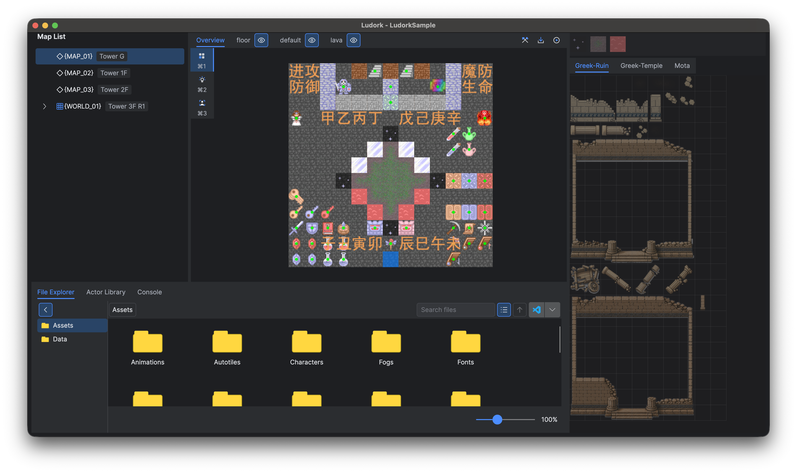
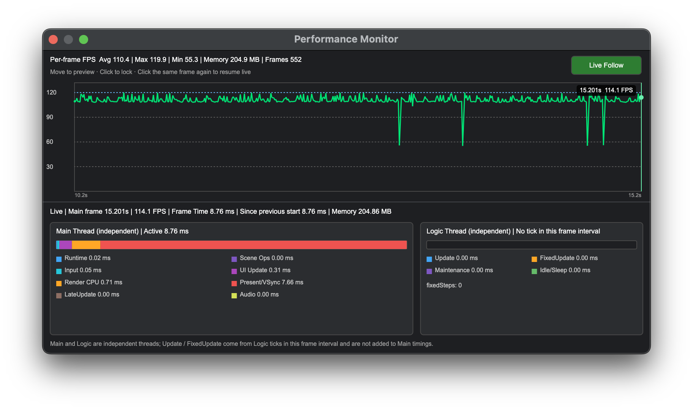

# 启动页、工作区与快捷键

## 目标

打开项目，认清主工作区的各个区域，掌握全局快捷键，并在编辑项目数据之前找到诊断入口。

## 安全编辑

- 运行或打包之前先保存。校验错误要回到出错源头解决。
- 资产的创建、重命名、复制和移动都通过编辑器完成，稳定标识与已跟踪路径才能保持有效。
- 用引用树查看已索引的引用。地图操作只保护可识别的结构化引用，不保护任意字符串。
- 文件资源放在 `Assets`，编辑器产出的项目数据放在 `Data`，运行时代码放在 `Scripts`。
- 只要某个操作会调用插件 Hook、原生构建或游戏进程，就要查看控制台。

## 启动页

启动页最多列出三个最近打开的项目，并提供 **新建项目** 与 **打开项目**。打开通过校验的 `.proj` 文件后，该项目会移到列表顶部。启动页加载时会清除已不可用的记录。打开 `Main.proj` 时，只有未保存内容的检查全部通过，才会替换当前项目。

把已有的 `.proj` 文件拖放到启动页任意位置即可打开。一次拖入多个文件时，编辑器只取第一个存在的 `.proj` 文件，其余文件忽略。

## 主工作区

主窗口包含地图列表、地图画布、编辑模式 Inspector 和**世界大纲**，下方为**文件浏览器**、**Actor 库**和**控制台**标签页。图块、光源和角色模式开关位于画布旁，世界地图模式下隐藏。工具栏提供 **编译 → 导出 → 运行** / **停止**；Standalone 项目隐藏编译按钮。操作流程见[运行、调试与打包](<运行、调试与打包.md>)。

编辑器采用紧凑的深色界面，以蓝色标识选中和焦点状态。文本框、数值输入、菜单和工具栏使用统一样式。地图、Tileset、文档和底部面板的标签页采用一致间距及单条蓝色指示线；悬停在未选中的标签上时显示半透明指示线。工具栏图标采用统一尺寸，新建项目和 UI 资产编辑器通过窗口标题标识当前界面，内容区不再重复大标题。只读路径字段不参与键盘焦点导航。

资源编辑器先显示加载视图，再分阶段准备内容。图片单独加载，关闭窗口会取消待完成的工作；初始化失败时可选择重试。通用数据页面按数据类型缓存，图块集页签只初始化一次，粒子折叠区域首次展开时才创建。动画总览在切换选中的动画时创建编辑器，并在该编辑器关闭时释放播放资源。

*可见的 Inspector 与画布交互随所选编辑模式变化。*

## 在线文档

**F1** 在编辑器内打开在线手册。文档版本取已安装编辑器版本号的前两段，例如 1.0.7 打开 `/Ludork/docs/v1.0/`。默认使用编辑器当前语言，章节 tabs 行右侧可以选择语言和版本。关于正文与第三方声明也在线加载，关于窗口仍显示已安装包的完整版本。

嵌入页面隐藏官网导航。文档链接留在窗口内，首页、下载及外部链接在系统浏览器中打开。在线页面需要网络连接，加载失败可点击 **重试**。Windows 需要 Microsoft Edge WebView2 运行时，缺失时提供安装入口；macOS 使用系统 WKWebView。

## 编辑器全局偏好

`Ludork.ini` 保存所有项目共用的偏好，重启编辑器后继续恢复。原有语言、最近项目与主面板设置保留在 `[Ludork]` 中；新增偏好和布局使用独立节及稳定标识。

| 区域 | 保存内容 |
|---|---|
| 主窗口 | 正常位置和尺寸、最大化状态、地图列表与 Inspector 宽度、下方区域高度、Actor 大纲与属性区比例，以及世界地图子地图列表宽度。 |
| 文件浏览器 | 图标／列表模式、内容缩放、来源栏展开／折叠状态，以及首选外部打开方式。 |
| Actor 库 | 图标／列表模式。 |
| 地图工具 | 光源模式的**可选中 Actor**开关。 |
| 工具窗口 | 按窗口类型保存位置、正常尺寸和最大化状态。 |
| 工具内容 | 现有可拖动分区的宽度或比例、UI 时间轴和系统控件分类的展开状态，以及粒子配置分组的展开状态。 |

工具窗口记录覆盖蓝图、UI、动画及总览、通用粒子及总览、曲线、图块集、文本配置、通用数据、公共函数、游戏变量、系统配置、游戏配置、地图属性、材质、结构字段和移动路线编辑器，以及文档、引用树、性能监视器与插件管理。内部可拖动分区覆盖蓝图属性栏，UI 左右栏、上下分区与时间轴轨道栏，粒子列表与属性栏，以及文本配置、通用数据、游戏变量、移动路线。同一编辑控件用于不同窗口时共用偏好。启动页、新建项目、确认提示、选择器、签名和打包对话框沿用各自原有布局。

默认使用图标模式、100% 文件浏览器缩放、折叠的来源栏和系统文件管理器，**可选中 Actor**关闭。偏好缺失或无效时使用默认值。项目浏览目录和地图选择保存在 `Main.proj`；全局偏好不会修改项目资源，也不恢复搜索文字、输入草稿、图层选择或画布视图状态。

恢复窗口时会遵守尺寸限制，并根据当前显示器工作区和缩放校正，使标题栏保持可见，也支持桌面负坐标的显示器。最大化不会覆盖正常窗口几何信息；最小化状态不会恢复。同类窗口以最后一次用户调整为准，已打开的窗口不会被强制移动，关闭旧窗口也不会覆盖较新的设置。初始化、隐藏面板及游戏运行期间的临时布局变化不会替换已存布局。

窗口移动和缩放在连续变化停止 300 毫秒后保存；分隔条结束拖动或通过方向键调整后保存，偏好切换立即保存，退出前刷新待保存的变化。内容未变时不重复写入。保存通过同目录临时文件进行原子替换；写入失败保留原文件并提示错误。数值采用固定格式，不受系统区域设置影响。

## 全局快捷键

Windows 上的主修饰键是 `Ctrl`，macOS 上是 `Command`。

| 快捷键 | 操作 |
|---|---|
| `Ctrl/Command+N` | 新建项目 |
| `Ctrl/Command+O` | 打开项目 |
| `Ctrl/Command+S` | 保存 |
| `Ctrl/Command+Z` | 撤销 |
| `Ctrl/Command+Shift+Z` 或 `Ctrl/Command+Y` | 重做 |
| `Ctrl/Command+W` | 退出或关闭项目窗口 |
| `Ctrl/Command+1` | 图块模式 |
| `Ctrl/Command+2` | 光源模式 |
| `Ctrl/Command+3` | 角色模式 |
| `F1` | Ludork 文档 |
| `F3` | 游戏配置 |
| `F4` | 系统配置 |
| `F5` | 动画总览 |
| `F6` | 通用粒子总览 |
| `F7` | 图块集数据 |
| `F8` | 公共函数 |
| `F9` | 游戏变量 |
| `F10` | 通用数据 |

部分文档窗口还会附加各自的上下文快捷键。在蓝图编辑器中，`F2` 重命名当前选中的事件页签；在公共函数窗口中重命名选中的公共函数；在文件浏览器中重命名选中的文件，macOS 上除外；在动画编辑器中重命名选中的时间标签。任何窗口都不显示 `F2` 提示。

只有一个按钮的提示与错误对话框，按 `Enter`、`Return`、`Space` 或 `Escape` 均可关闭。确认对话框中，`Enter`、`Return` 与 `Space` 表示确认，`Escape` 表示取消。

## 编辑与保存

支持清空的文件字段会在文件选择窗口中显示**清空**，始终位于每个目录和文件类型筛选的第一项。选中后点击**打开**、按回车或双击该项即可清空字段；点击**取消**或按 Escape 保留原值。保存窗口、多文件导入和必须选择实际文件的窗口不提供该项。

界面上显示的字段默认值，只在字段被编辑后才写入。

受管资源的改动在保存之前只留在内存中。所有保存按钮与 `Ctrl/Command+S` 都会写入全部已修改文档，包括未打开的资源；编译、导出、运行和打包走同一套流程。保存成功不弹出结果提示；保存失败时仅显示失败项及其错误。普通保存会校验改动过的蓝图，强制保存则可以保留尚未完成的图。[游戏配置](<项目设置与资产布局.md#mainini>)在确认时立即写入。

撤销与重做只作用于当前活动文件，每个文件保留最近 100 条记录。显示同一文件的多个窗口共享数据与历史，关闭后重新打开依然如此。同一字段中连续的文本或数字输入会合并为一步。切换控件或编辑视图、自动更新、保存、撤销和重做都会结束该步。按钮、复选框和选择操作则各自单独成步。

普通撤销与重做恢复当前文档时不重建项目引用索引。如果本次项目会话中删除过资源，编辑器会先检查待恢复文档及其解析依赖。恢复后会引用已删除资源的步骤将被拒绝，文档内容与历史保持不变。地图编辑只刷新受影响的地图，保留所选地图、仍然存在的图层选择和视口；无关资源的编辑不会重建地图列表或清空地图图片缓存。

自动更新引用时，每个被改动的目标文件中都会留下一个带标记的撤销屏障，未打开的文件也不例外。之后的编辑仍可撤销，但撤销无法越过屏障，并会提示屏障的来源。撤销或重做源文件的重命名时，编辑器按目标文件的当前内容更新引用，并加入新的屏障，无关的编辑因此得以保留。保存会同时保留历史与屏障，所以已保存的文件可以因撤销而再次变为已修改。

已修改的文件在文件浏览器和编辑器标题中显示 `*`，资源选择器也会标记。关闭或替换项目时会列出未保存的文件，并提供 **保存**、**不保存** 和 **取消**，其中 **保存** 会写入每一个已修改的文档。保存失败会保留修改标记并阻止关闭。关闭资源窗口后，未保存的数据会一直保留到项目关闭。

## 文件浏览器与引用树

文件浏览器通过来源栏和面包屑浏览 `Assets` 与 `Data`，“返回上级”到所选根目录为止。打开项目时恢复上次有效的浏览目录，默认进入 `Assets`。

右键条目打开文件操作菜单，右键空白处打开当前目录菜单。粘贴快捷键以当前浏览目录为目标。

右键文件或文件夹，选择 Windows 上的**在文件资源管理器中查看**或 macOS 上的**在 Finder 中查看**，可打开其所在目录并选中该条目。展开的子目录和搜索结果同样支持此操作。多选时只定位右键点击的条目；磁盘上尚不存在的条目会禁用该操作，点击不会保存资源修改。

列表视图中，点击文件夹箭头可原地展开或收起多级目录，双击文件夹进入目录。`Right` 展开文件夹或选中第一个子项，`Left` 收起文件夹或选中父项。展开状态在本次项目会话中保留；图标视图和搜索结果保持平铺。

搜索按文件名匹配当前目录及子目录中的文件，忽略大小写；结果包含未保存资源，并显示相对路径。清空搜索恢复浏览，切换目录或定位文件会清空搜索。符号链接文件夹不参与展开和递归搜索。

按住 `Ctrl/Command` 滚动滚轮，或使用右下角滑杆，可在 50%–200% 之间缩放图标和文字。按 F5 刷新外部文件变更。

预览逐步加载，动态预览仅在条目可见时播放。音频条目使用系统音频图标，无法获取时显示音符图标。视频条目在后台加载封面帧，在图标和列表视图中均保持画面比例。封面由 macOS AVFoundation 或 Windows 系统缩略图提供程序生成，支持的格式取决于系统；加载期间或无法获取封面时显示视频图标。媒体缩略图共用图片缓存，文件变化后会刷新。

在文件选择对话框中选中项目的蓝图 JSON 文件时，右侧会显示与文件浏览器一致的角色外观及动画，并反映当前未保存的修改和继承属性。蓝图没有外观或贴图缺失时显示文件图标，普通 JSON 文件仍显示文本。切换文件、进入目录、清空选择或关闭对话框时，会取消待完成的预览并释放上一项预览资源。

在 File Explorer 中选中图片、音频或视频文件，按 **空格**可打开预览窗口。文件选择对话框也会在右侧预览选中的音频或视频。两个入口共用媒体播放器，提供播放、暂停、进度跳转和音量控制。媒体默认暂停；切换文件、清空选择或关闭窗口会停止播放并释放文件。播放器获得焦点后，**Escape** 仍可关闭预览窗口或取消文件选择。

媒体预览识别 OGG、WAV、FLAC、MP3 等常见音频，以及 MP4、MOV、WebM 等视频容器。实际播放能力取决于系统 WebView 支持的编码；文件损坏或格式不受支持时会显示错误。Windows 需要 Microsoft Edge WebView2 运行时，macOS 使用 WKWebView。预览无需启用项目的 FFmpeg 选项或构建原生游戏，文件通过本地服务读取，不会上传。

文件浏览器管理项目文件，并可创建蓝图、动画、通用粒子、曲线、文本配置和 UI 资产。引用树显示传入与传出引用。地图操作以原子方式更新或保护可识别的已索引引用，任意字符串不受管理。

项目在内存中共用一份引用索引，首次使用时建立，此后持续维护。引用树在后台构建和刷新，并合并 150 ms 内的连续变更。首次打开时显示加载状态，刷新期间保留旧图并显示更新提示；成功刷新后保留平移与缩放，失败时显示错误。删除和重命名的检查会同步补齐到项目当前数据，不会根据界面上仍在显示的旧图放行资源操作。

新建或复制的受管资源处于未保存状态，创建动作本身不产生撤销步骤。重命名会立即反映在编辑器中。全局保存时，新路径与更新后的引用一起写入磁盘。删除之前，必须先移除并保存所有可识别的引用。确认删除立即生效，且无法撤销。

复制粘贴重名时自动使用 `name_copy.ext`、`name_copy2.ext` 等名称，不覆盖已有文件或文件夹。

右上角的打开菜单始终提供系统文件管理器，用于打开当前浏览目录。选择菜单项后会保存为首选打开方式；如果它在其他项目或当前计算机上不可用，按钮暂时使用系统文件管理器，同时保留已保存的偏好。只有安装了对应程序时，才会列出 VS Code 或 Cursor。C++ Source 项目还会列出已安装的 CLion，Windows 上另有 Visual Studio 2022。VS Code、Cursor 和 CLion 始终打开项目根目录，不受文件浏览器当前目录影响。如果本机缺少 `.idea` 或 `.vs` 配置，首次打开 CLion 或 Visual Studio 时会先询问，再决定是否运行项目自带的环境生成器；取消则项目保持原样。Visual Studio 打开的是项目根目录下生成的 `Main.sln`。

## 控制台与性能监视器

控制台汇集插件、构建和运行时的输出。只有兼容的运行时连接就绪后，才能向控制台发送输入。游戏运行期间，**编辑 → 开发工具与设置 → 性能监视器** 会显示最近的帧、逻辑和内存样本。

### 大地图流送样本

对组合式大地图做性能采样时，性能监视器会附带一个可选的 `worldStreaming` 快照。普通地图和未采样的 tick 都不包含它。

| 字段 | 含义 |
|---|---|
| `queueDepth` | 排队等待流送的子区域数量。 |
| `reading` | 当前处于 `Reading` 状态的区域数量。 |
| `prepared` | 已加载且处于 `Prepared` 状态的区域数量。 |
| `active` | 处于 `Active` 状态的区域数量。 |
| `dormant` | 已加载且处于 `Dormant` 状态的区域数量。 |
| `cacheBytes` | 非 Active 区域缓存采用的保守估算值。它并不等于精确的进程、Lua、native 或 GPU 内存占用。 |
| `publishMilliseconds` | 一次逻辑 tick 中转换并发布区域所花费的时间。 |
| `visibleTileChunks` | 最近一次绘制中，可见子图层提交的不重复 32×32 格 TileLayer chunk 数量。 |
| `activeActors` | 当前位于大地图 Active 更新与绘制批次中的 Actor 数量。 |

*控制台记录启动进度、运行时诊断与进程结束结果。*

*没有兼容的运行时会话时，监视器保持等待是正常现象；连上遥测后，时间轴才会开始填充。*

## 限制

上下文窗口可以绑定额外的快捷键，但不会改变全局 `F3`–`F10` 映射。

## 相关页面

- [通用粒子](<通用粒子.md>)
- [项目设置与资产布局](<项目设置与资产布局.md>)
- [运行、调试与打包](<运行、调试与打包.md>)
