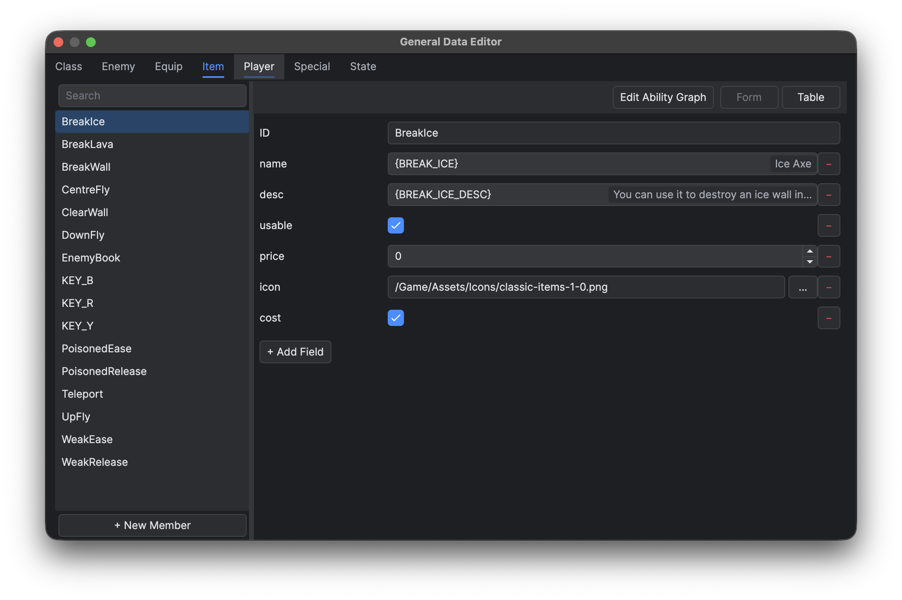
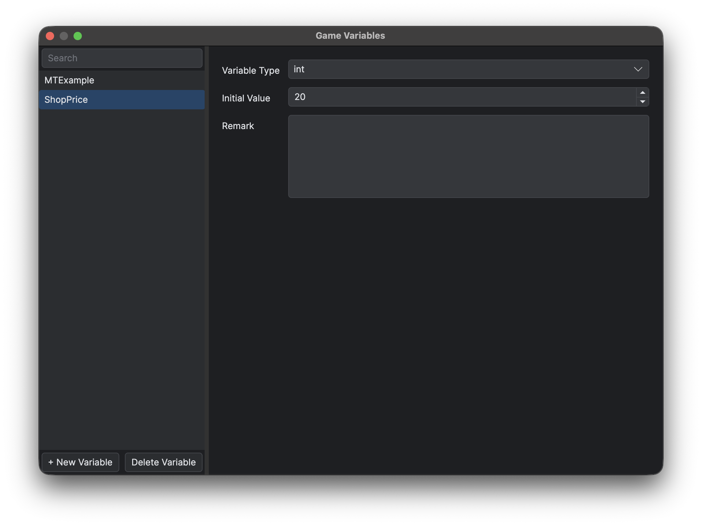
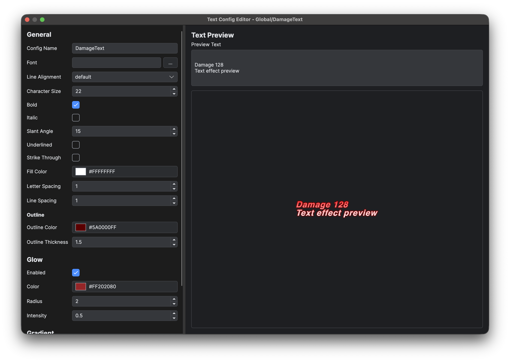

# 通用数据与文本配置

通用数据是编辑器管理的数据库，位于 `Data/General`，适合存放敌人、物品、装备、玩家预设、状态等会被多张地图或多个蓝图共用的数据。每个 JSON 文件定义一个类型 schema 和若干命名成员。同一个类型文件的 Form、Table 与成员能力图窗口共享一份文档和一份撤销/重做历史。

## 目标

定义可复用的数据 schema，录入通过校验的成员，并创建文本配置，全程不破坏已有的运行时引用。

## 类型结构

| 键 | 含义 |
|---|---|
| `params` | 有序字段定义，包含 `type`、`defaultValue`、可选的 `comment`，以及枚举和容器的递归类型 schema |
| `members` | 为这些字段保存值的命名记录 |
| `events` | 可选的有序事件名；每个成员可以为各事件保存独立的图 |

支持的字段有字符串、布尔值、整数、浮点值、文件、列表、字典，以及 `sf.Vector2f/i/u`、`sf.Vector3f/i/u`、`sf.Color` 与 `sf.IntRect`。新增或编辑的字段保存完整递归 `type`，例如 `{ "list": "int" }` 或 `{ "dict": "int", "key": { "enum": "Enums.GeneralData.Item", "valueType": "string" } }`。已有的 `"type": "list"` 加 `itemType`、`"type": "dict"` 加 `valueType` 仍可读取。枚举、元组与联合类型的组合规则见 [Metadata 结构与 Decorator](<../Lua 与蓝图脚本/蓝图脚本/Metadata 结构与 Decorator.md>)。填写联合类型的值之前，先选中分支。

在 **添加字段** 或 **编辑字段** 中选择 `enum`，通过 **kind** 选择模块，再选择推断或显式的标量值类型及默认值。项目托管枚举使用 `string`，空源码枚举必须显式声明标量类型。字典的键类型和键枚举可独立于值类型选择。这些选择器直接写入 schema，不保存单独的 `kind` 或 `reference` 属性。

物品键使用 `{ "enum": "Enums.GeneralData.Item", "valueType": "string" }`；类型键使用 `Enums.GeneralDataKey`，动画键使用 `Enums.Animation`，粒子键使用 `Enums.Particle`。选项来自实时项目目录，包括未保存的新增、重命名和删除。列表、字典键和值、元组及联合类型共用这一机制。普通枚举仍在显示或展开选择器时读取常量源码模块。

缺少子类型、成员字段缺失或出现 schema 之外的、不以下划线开头的字段，以及值与 schema 不符，加载时都会失败。需要存放类型不一的 JSON 值时使用 `any`：它保留字面类型，也从不把字符串当作代码求值。

`linkedType` 不受支持，出现即被拒绝。

每个字段定义可以保存一段可选的英文 `comment`。新增或编辑字段时通过 **注释** 填写，注释为空则不写入。把鼠标停在 Form 的字段名或 Table 的表头上会显示该注释。这条 schema 注释与恰好命名为 `desc` 的字段中保存的成员值不是一回事；它只是项目里的普通文本，不是 locale key。

字符串枚举选择器包含 **— 不选择 —**，保存为空字符串。未知的非空值会保留；枚举校验标量类型，不强制限定选项成员。空的托管集合仍是有效的字符串枚举。枚举键字典的新行会一直待定，直到选中非空且唯一的键，不会保存占位键。旧 `GeneralDataVars` decorator 与通用数据字段 `reference` 协议不受支持；这些选项应通过类型 schema 表达。

JSON schema 或 Lua metadata 声明的通用数据成员枚举都算类型文件依赖，包括没有取值的字段、空容器、未选中的联合分支和命名结构内的字段；这些依赖参与删除检查。引用扫描还会递归检查值、字典键和已保存的联合分支描述符。枚举 ID 中的空白和引号按字面保留，不会被裁剪或当作表达式解释。

类型重命名只会自动更新存放在可编辑 JSON 中的可识别模块路径，包括自身引用，以及因标识符冲突而重新分配的其他模块名。Lua metadata 声明的依赖仍会显示，但不会触发源码改写。动画与粒子重命名会更新具有对应类型的标量引用。字典键冲突会拒绝整次重命名，不留下部分修改；Undo/Redo 按统一的[引用更新规则](<启动页、工作区与快捷键.md#编辑与保存>)恢复关联引用。删除被引用类型前应先移除并保存依赖。普通字符串以及 Lua 或 C++ 源码不会被改写。

## 步骤

1. 打开 **数据库 → 通用数据**（`F10`）。
2. 选择一个类型，或右键点击类型标签栏创建类型。
3. 在批量创建成员之前先定义好字段。右键单击 Form 中的字段名即可编辑它的定义。
4. 添加成员并填写它们的值。右键点击成员列表条目或 Table 行，可以修改 ID、复制、删除成员，或打开可用的能力图。
5. 通过类型标签的右键菜单管理该类型的事件，再用 **编辑能力图** 打开成员图。重命名或删除事件会更新全部成员图；运行时显式激活这些图。
6. 重命名或删除类型、成员之前，先查看引用。
7. 保存后，实际跑一遍读取这些数据的运行路径。

保存会重新生成 `Enums.GeneralDataKey`（类型键）、每个类型独立的 `Enums.GeneralData.<TypeName>` 模块（成员键）、`Enums.Animation`、`Enums.Particle`、`Source.Configs.GeneralDataTypes`（带类型的 `<TypeName>AttributeSet` 类）及 `GeneralDataTypes` 的 LuaLS 声明。每个枚举源码用 `---@enum Enums.GeneralDataKey` 或对应的 `---@enum Enums.*` 注解 声明 key 到字符串值的局部表，然后返回该表，无需独立 stub。例如，`local Item = require("Enums.GeneralData.Item")` 提供 `Item.EnemyBook`。

保存托管数据（包括动画与粒子变更）时，枚举源码在同一原子文件批次中更新；批次失败时保留已有文件。重命名或删除数据类型会替换或移除所属的枚举文件，不删除手写文件。生成的类型名在不区分大小写的文件系统中也不会冲突，成员 key 仍保留大小写。用 `GeneralDataTypes.Create(typeName, memberID, memberData)` 按 ID 与字段类型还原已保存的成员。需要修改这些输出时，应编辑数据库记录。

大型通用数据在校验成员与能力图、生成输出和写入文件时，使用统一的[保存进度窗口](<启动页、工作区与快捷键.md#编辑与保存>)。仅保存状态变化时，页面不会重建内容，搜索条件、选中成员、Form/Table 视图及滚动位置均保持不变。

编辑字段可以改动它的名称、类型、容器元素或值类型、默认值与注释。重命名会保留每个成员当前的字段值。修改字段类型、列表的元素类型或字典的键或值类型时，编辑器先请求确认，然后把所有已有成员中该字段重置为新默认值。只改默认值不会覆盖已有成员。删除字段会移除它的含义，但不会自动修复读取它的脚本。

## 搜索与视图

成员搜索不区分大小写，匹配成员 ID，也匹配名称、数字、布尔值等直接标量值。它不会递归搜索列表、字典、tuple 或图的内容。通用数据窗口保持打开期间，每种数据类型都会保留当前的搜索内容、选中成员与 Form/Table 选择，撤销或重做重建页面后依然如此。这些状态不会写入项目。

Form 为单个成员提供完整编辑器。Table 按声明顺序显示 ID 与 schema 字段，可以直接编辑布尔、整数、浮点和字符串字段，带引用的字符串仍使用选择器。文件、列表、字典、tuple 以及未知的结构化字段只显示摘要和一个 **编辑**，点它即选中该成员并回到 Form，因此结构化 JSON 永远不会被显示用的字符串替换。Table 的行做了纵向虚拟化，固定宽度的列可以横向滚动。

文本与数字输入遵循统一的[撤销规则](<启动页、工作区与快捷键.md#编辑与保存>)；成员操作与 schema 操作各自成步。

*先定义好 schema 再录入记录，确保所有成员都使用预期的字段类型。*

## 游戏变量管理器

打开 **数据库 → 游戏变量**（`F9`），声明由蓝图与当前游戏实例共享的可变值。左侧列出已声明的变量名。选中一项后，在右侧编辑它的类型、初始值与可选备注；备注只在编辑器内可见，对运行时没有影响。变量名是运行时标识符，一旦图、地图或脚本开始引用，就应保持稳定。

用搜索框按变量名过滤，不区分大小写。**新建变量** 会先询问名称与类型，然后添加一条声明；**删除变量** 在确认后移除当前选中的声明。

*在右侧详情区修改当前声明的类型、初始值和仅供编辑器查看的备注。*

创建变量时就要选定类型。Manager 提供 `bool`、`int`、`float`、`string`、`list` 与 `dict`，写入 metadata 时依次对应 `bool`、`int`、`float`、`string`、`any[]` 与 `Dict[string, any]`。列表与字典使用普通 Lua table，而不是 Standard 的原生 `list` 或 `dict`。修改已有变量的类型会清空它的初始值，换成新类型的空默认值。

Manager 把 `Scripts/Source/Configs/GameVariables.lua` 与 `GameVariables_meta.lua` 当作一份文档，共享撤销/重做历史。打开它不写入任何内容；文件缺失时在全局保存时生成。编辑会立即更新内存中的声明与选择器。

全局保存会一起重新生成这两个文件；生成或写入失败时，文档保持已修改状态。运行时文件保存名称到初始值的映射，metadata 保存有序名称、类型与非空的 `Meta.Remark`。不得手工修改这些生成文件。

带 `InstVar` 标记的蓝图字段或节点参数使用可搜索的选择器，而不是自由输入的文本框。配套的 `InstVarValue` 字段读取所选声明的类型，并切换为该类型的常规编辑器。带类型过滤的选择器只列出兼容的变量，Game 项目的条件门即为一例。

## 文本配置

普通 UI 文本的样式设置在它自己的 UI 节点上。只有共享文本、特殊文本和富标签样式才使用 **游戏 → 新建文字配置**。已被引用的 key 要保持稳定；schema 有改动后，验证运行时的使用方。

*文本配置为项目使用的结构化文本数据提供专用编辑界面。*

通用数据原样保存每个字符串，字符串字段不会自动本地化，因为同一字段类型还承载 class、animation、装备槽位等语义标识符。像 `{ITEM_NAME}` 这样带花括号的显示值，只在展示边界交给 `LOC`；生命周期较长的 UI 在响应语言切换时，需要再解析一次。语言表的格式与运行时的格式化函数见 [游戏本地化工作流](<../插件开发与安装/Official 插件/游戏本地化工作流.md>)。

生成的通用数据与游戏变量 Lua 文件以 UTF-8 保留 Unicode 字符串，包括中文、emoji 和 C1 控制字符。引号、反斜杠与 ASCII 控制字符会被转义，确保编辑器重新打开和游戏加载时读取到相同的值。

`Source.Gameplay.GeneralDataGraphAbility` 以 `GameplayEventData` 为 context 显式激活成员图。这类图不提供伪 parent 或 self 节点，因此请使用全局节点与该 context。start 为 `null` 时返回 `NoGraph`。所有图都同步执行，拒绝 latent 节点，并向外传播错误。

纯图编辑器从类型的 `events` 取事件列表，没有类属性，也没有蓝图继承。保存项目时会拒绝未声明的事件与 latent 节点。

Game 各类型的精确 schema，见通用数据参考各页。

## 限制

修改 schema 或游戏变量声明，不会自动修复脚本、图、存档或字符串引用。通用数据与生成的游戏变量声明属于项目定义数据，不用来保存可变的对局状态。

## 相关页面

- [Class](<通用数据参考/Class.md>) — Game 项目的 Class schema
- [蓝图、公共函数与 Actor](<蓝图、公共函数与 Actor.md>)
- [游戏本地化工作流](<../插件开发与安装/Official 插件/游戏本地化工作流.md>)
