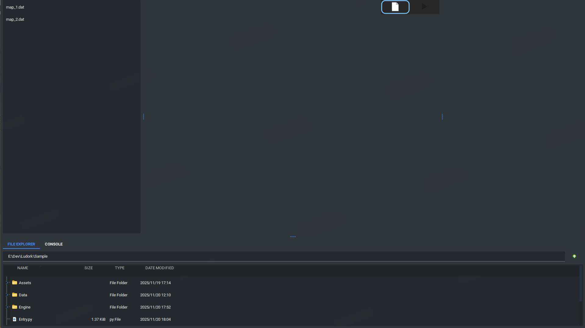
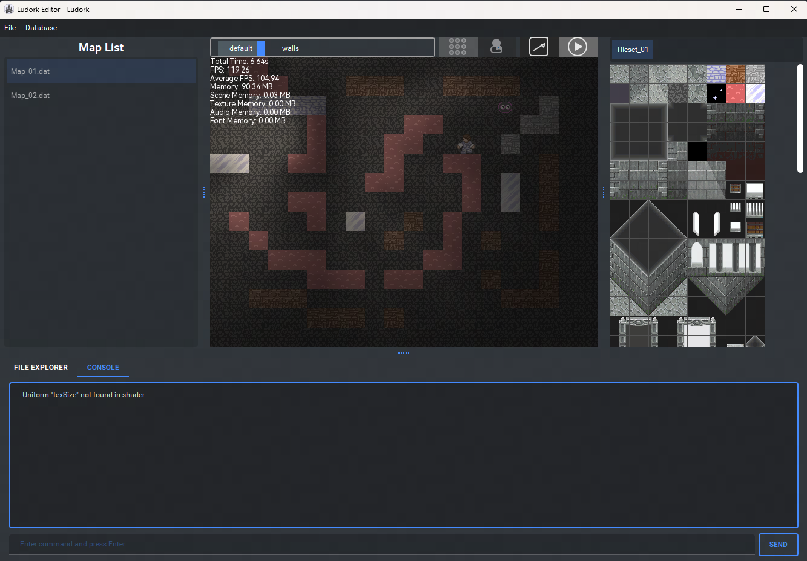
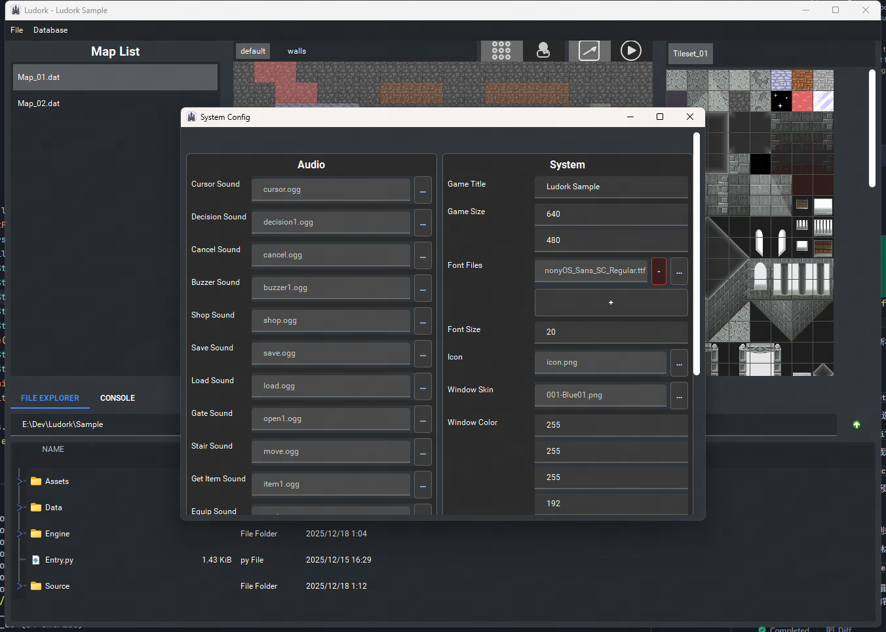

# Ludork

Ludork is a lightweight 2D game editor and runtime built with PyQt5. It ships with a sample game project and an embedded engine so you can edit maps, manage assets, configure system settings, and play-test the game directly inside the editor.

The editor persists window and panel layout in `Ludork.ini`, supports themes via `qt-material`, and provides multi-language UI (English and Chinese) through the `Locale` folder.

## Features
- Integrated editor UI: tile/actor tools, map editor, file explorer, and console
- In-editor play-test: launch and stop the game without leaving the editor
- Config window: edit structured system settings (fonts, window skin, shaders, etc.)
- Theme and language: pick a `qt-material` theme and auto-detected language stored in `Ludork.ini`
- Persistent layout: remembers window size and splitter widths across sessions
- Packaging: build a single-file sample executable and pack the standalone editor with Nuitka

## Quick Start
- Option A: Run `init.bat` or `init.sh`
  - Activates existing `LudorkEnv` and runs `main.py`
  - Or creates `LudorkEnv`, installs dependencies, then runs `main.py`
  - On failure during creation or installation, the script removes `LudorkEnv` to keep the workspace clean

- Option B: Manual setup
  - Create venv: `py -m venv LudorkEnv` or `python3 -m venv LudorkEnv`
  - Activate: `LudorkEnv\Scripts\activate`
  - Install: `pip install -r requirements.txt`
  - Run: `python main.py`

## Build & Pack
- Pack the editor: run `pack.bat` (produces a standalone distribution in `build/`)

## Preview
- Main Editor

  

- In-Editor Game (Play Test)

  

- Config Window

  

## Dependencies
- `PyQt5==5.15.10`
- `qt-material==2.14.0`
- `psutil`
- `pympler`
- `nuitka`

Install all with `pip install -r requirements.txt`.

## License
Distributed under the GPLv3. See `LICENSE.md` for details.
