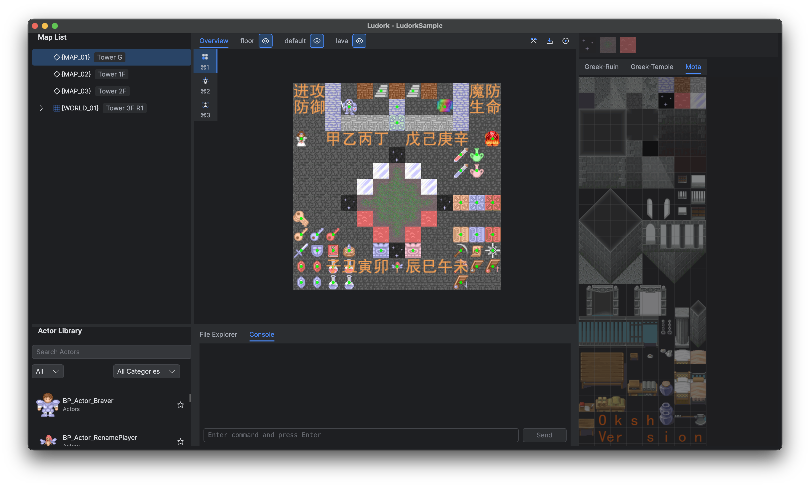

# Ludork

[English](README.md) · [简体中文](README_zh_CN.md)

Ludork is a game editor and native runtime for creating 2D role-playing games. It combines visual map and data authoring, Blueprint graphs, Lua scripting, and a C++20 runtime in one production workflow.



## What Ludork provides

- A unified editor for projects, maps, tilesets, actors, animations, curves, general data, text configuration, and declarative UI assets.
- Blueprint graphs for visual gameplay logic, with Lua modules and direct script attachments for code-driven systems.
- A C++20 runtime built on LuaSF and SFML, with generated bindings, LuaLS definitions, and Blueprint metadata.
- Four project templates: Standalone, Standalone with FFmpeg, C++ Source, and C++ Source with FFmpeg.
- Fully trusted C# 13 editor plug-ins for adding commands, tools, project operations, and editor integrations.

## Supported platforms

| Area | Supported target | Notes |
| --- | --- | --- |
| Ludork editor | Windows 10 or newer, x64 | Distributed as a self-contained Windows package. |
| Ludork editor | macOS 13.3 or newer, Apple Silicon | Distributed as a native `.app` bundle. |
| Desktop game projects | Windows 10 or newer, x64; or macOS 13.3 or newer, Apple Silicon | A project is created from the template for the editor's host platform. |
| iOS game projects | iOS 15.0 or newer, arm64 | Packaging requires a C++ Source project, Apple Silicon macOS, full Xcode, and Apple development signing. |
| HarmonyOS game projects | HarmonyOS 6.0.1 / API 21 or newer, arm64-v8a | Mobile HAP packaging requires a C++ Source project, Apple Silicon macOS, and DevEco Studio. |
| Android game projects | Android 7.0 / API 24 or newer, arm64-v8a | APK packaging requires a C++ Source project, Apple Silicon macOS, Android Studio, SDK Platform 36, Build Tools 36.0.0, Android NDK r27 or newer, and host CMake 3.28 or newer. Output is unsigned by default and may optionally be signed with an existing JKS or PKCS12 keystore. |

Linux and Intel-based macOS editor packages are not provided in Ludork 1.0.0.

## Install a release

1. Open the [Ludork Releases page](https://github.com/JasonLeon01/Ludork/releases) and download the package for your computer.
2. Install or extract the package as described in the release notes.
3. Start Ludork and select a language.
4. Create a project from the start page, or open an existing `Main.proj` file.

Release packages are self-contained; installing a separate .NET runtime is not required. macOS may ask you to confirm that you trust an application downloaded from the internet.

## Choose a project template

| Template | Choose it when | Development requirements |
| --- | --- | --- |
| **Standalone** | You want to author Lua, Blueprints, maps, data, and assets immediately. | No C++ toolchain is required. |
| **Standalone + FFmpeg** | You need the Standalone workflow and H.264/AAC MP4 playback. | No C++ toolchain is required; FFmpeg notices and source materials are included. |
| **C++ Source** | You need to change native engine code, add bindings, debug C++, or target iOS, HarmonyOS, or Android. | CMake 3.21 or newer and the platform compiler toolchain. Android packaging requires CMake 3.28 or newer. |
| **C++ Source + FFmpeg** | You need native source access and video playback. | The C++ requirements above; the project contains the FFmpeg source and build configuration. |

FFmpeg is disabled by default. The prebuilt FFmpeg Standalone templates target desktop platforms; use a C++ Source template for iOS, HarmonyOS or Android output. Those mobile applications statically link their FFmpeg builds and therefore have additional LGPL relinking-material obligations; review the bundled FFmpeg notice before distribution.

### Debug a C++ Source project in an IDE

IDE configuration generators are included in the root of C++ Source projects. On Windows, run `generate_vs2022.bat` and open `Main.sln` from the project root, or run `generate_clion.bat` and open the project directory in CLion. On Apple Silicon macOS, run `./generate_clion.sh` and open the project directory in CLion. Both CLion generators configure the CMake project before returning, so **Ludork Play** can be selected and run immediately after the project opens.

Visual Studio Run and Debug use the same Debug C++ build tool as editor Play, use the project root as the working directory, and start the same native individual-window flow. CLion builds the same `Main` target from its generated Debug profile. Editor-only save handling, plug-in Before Run hooks, embedded viewport integration, and editor command or performance bridges are not available when launching from an IDE.

The generators find the tools installed with Ludork automatically. If the editor was moved or is used as a portable package, set `LUDORK_TOOLS_DIR` to its `tools` directory before running a generator. Generated `Main.sln`, `.vs`, `.idea`, CMake user presets, and CLion build output are local files and are excluded by the template `.gitignore`.

## Create, run, and package your first project

1. Select **New Project**, choose **Standalone** for a prebuilt desktop runtime or **C++ Source** when you need native source access or an iOS, HarmonyOS, or Android package, enter a project name and location, then select **Create**.
2. Save your changes and use **Play** to run the project in the editor or in a separate game window.
3. Before distribution, replace the default `LudorkSample` value assigned to `APP_NAME` in `Scripts/Entry.lua`.
4. Select **File → Pack Project**, choose the target and options, and complete the platform-specific prompts.
5. Test the resulting `dist` package on a clean target system before publishing it.

Packaging through the editor runs registered plug-in preparation hooks. A Standalone project can be edited and packaged without compiling C++; a C++ Source project performs the required native build.

For Android, leaving **Sign APK** clear creates `dist/<game-name>-android-arm64-v8a-unsigned.apk`. Selecting it opens a second dialog for an existing JKS or PKCS12 keystore, key alias, keystore password and key password; the key password defaults to the keystore password. These credentials are used only for the current package and are not saved. A successful signed build publishes only `dist/<game-name>-android-arm64-v8a-signed.apk`. Reuse the same signing key for later versions of an installed application. Neither Android mode installs or launches the APK.

## Build Ludork from source

Source builds are intended for contributors and editor developers. End users should normally install a release package.

Requirements:

- .NET 9 SDK
- CMake 3.21 or newer
- Windows: Windows 10 or newer with Visual Studio 2022 and the MSVC x64 toolchain
- macOS: Apple Silicon, Xcode Command Line Tools, and macOS 13.3 or newer
- Python 3.12 for native binding-generation tools

Windows:

```bat
tools\init.bat
tools\run_editor.bat
```

macOS:

```sh
./tools/init.sh
./tools/run_editor.sh
```

The initialisation script prepares the native dependencies and the editor-owned UI preview host. It does not build the Sample game. Build the Sample separately with `tools\build_cpp.bat Sample Debug` or `./tools/build_cpp.sh Sample Debug`.

## Documentation and support

- Start with the [Ludork documentation](docs/en_GB/00.Ludork%20Documentation.md).
- Follow [Getting Started](docs/en_GB/01.Getting%20Started/00.Overview.md) for installation, project creation, running, and packaging.
- Report reproducible faults and request features through [GitHub Issues](https://github.com/JasonLeon01/Ludork/issues).

When reporting a problem, include Ludork 1.0.0, your operating system, the selected template, the steps to reproduce the problem, and the relevant Console output. Do not attach projects containing credentials or content you cannot redistribute.

## Plug-in security

Ludork editor plug-ins are C# source packages that execute with the editor process's full user permissions. Import and enable only plug-ins whose source and publisher you trust. Review updates before installing them, and never treat a plug-in package as sandboxed content.

## Licences and asset rights

Ludork itself is distributed under the [Zlib License](LICENSE.md), including commercial use. Dependencies and redistributed tools remain under their respective terms; see the [Third-Party Notices](THIRD_PARTY_NOTICES.md) and the [complete licence-text index](Licenses/README.md).

Project templates carry the Ludork licence together with the applicable game-runtime, optional video-runtime and bundled-asset notices and complete local licence texts. Editor, managed-runtime, preview-host and build-tool notices remain in the editor distribution and are not copied into projects. Packaging preserves project legal materials when they are present, but Android packaging does not treat them as APK-format prerequisites or verify legal completeness. Preserve the applicable materials, add notices for your own dependencies and assets, and review the result before distribution.

The Sample project's bundled music is not covered by the Ludork Zlib License. Its Suno Free Tier terms restrict use to personal, non-commercial purposes and do not establish permission to redistribute the raw track in a project template. Remove or replace the track, or obtain express redistribution rights, before publishing any package that contains it. The Sample font retains its supplied terms.
