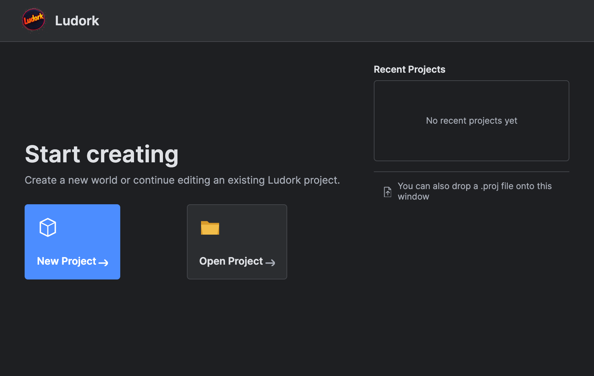
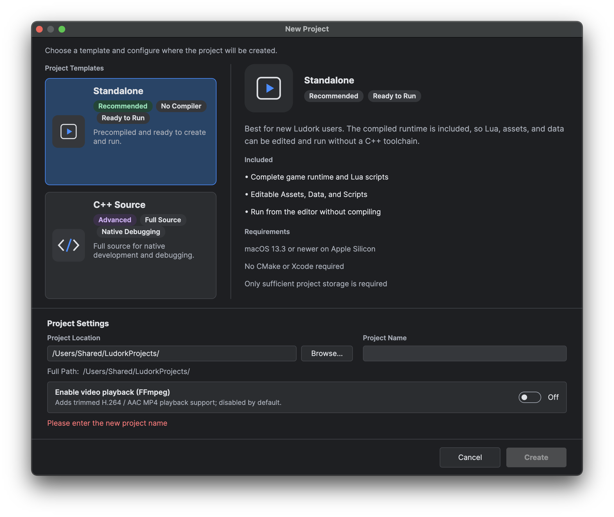

# Create Your First Project

## Goal

Create a Standalone project, open its initial map and run it.

## Steps

### Create the project

1. On the Start page, choose **New Project**. In an open project, use **File → New Project** or Ctrl/Command+N.

*The Start page is the entry point for creating or reopening a project.*

2. Select **Standalone**.
3. Leave **FFmpeg** disabled unless the game must play video.
4. Choose an existing destination directory and enter a new project name.
5. Review the final path, then choose **Create**. Ludork copies the selected template and opens `Main.proj`.

*Standalone is the recommended first-project template because it includes a ready-to-run native runtime.*

### Save and run

1. Select a map in the map list.
2. Press Ctrl/Command+S. Resolve any validation message before continuing.
3. Choose the Play action on the toolbar. The game runs in the embedded panel or an individual window, according to **Edit → Development Tools → Individual Window**.
4. Watch the Console for hook, build and runtime output.
5. Stop the game before changing template or packaging settings.

## Important project files

| Path | Purpose |
|---|---|
| `Main.proj` | Project capabilities such as C++ source, FFmpeg and run-window preference. |
| `Main.ini` | Runtime settings, including the entry script, language and audio/display values. |
| `Scripts/Entry.lua` | Lua entry point. |
| `Data/` | Maps, Blueprints, General Data, animation, curves, text configuration and UI assets. |
| `Assets/` | Textures, audio, fonts, shaders and other file resources. |

## Related pages

- [Project Templates](<02.Project Templates.md>)
- [Lua Basics](<03.Lua Basics.md>)
- [Start Page, Workspace and Shortcuts](<../02.Editor User Guide/01.Start Page Workspace and Shortcuts.md>)
- [Run, Debug and Package](<../02.Editor User Guide/08.Run Debug and Package.md>)
