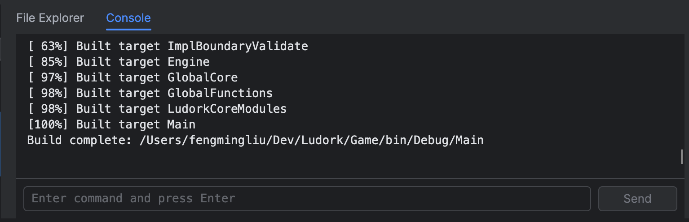
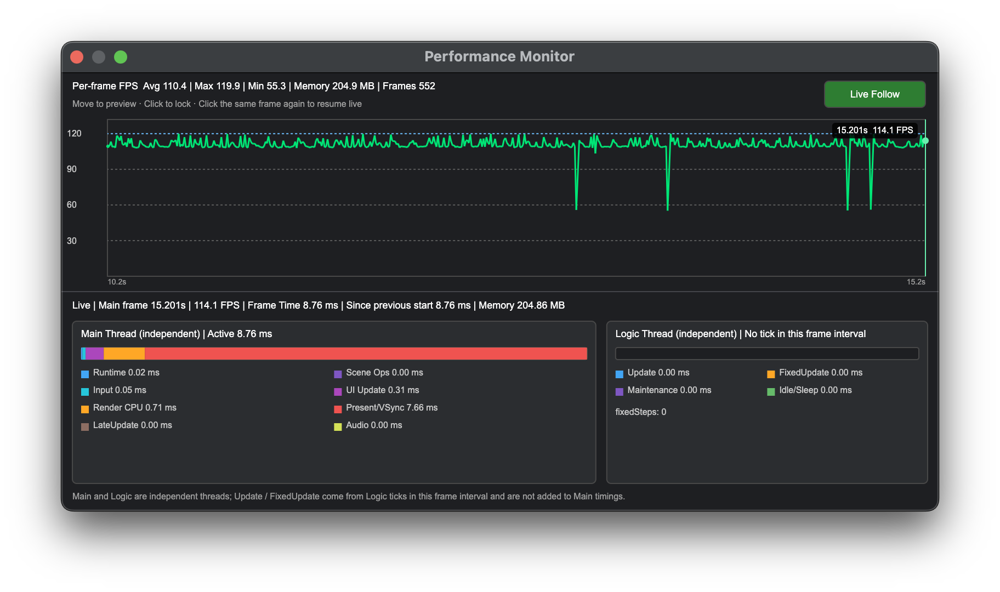

# Start Page, Workspace and Shortcuts

## Goal

Open a project, identify the primary workspace regions, use the current global shortcuts and locate diagnostics before editing project data.

## Start page

The Start page lists recent projects and provides **New Project** and **Open Project**. Opening `Main.proj` replaces the current project only after unsaved-work checks succeed.

## Main workspace

The main window contains the map list, map canvas, editing-mode inspector, Actor outliner, project file explorer and Console. The toolbar switches between Tile, Light and Actor modes and controls the game process.

The default workspace window size is 1512×982, with a 320-pixel map list, 320-pixel Actor Library and 400-pixel right inspector. The editor saves the window size and the map-list, Actor-Library, inspector and lower-area sizes after resizing.

Animation Overview, Tilesets, General Data, Common Functions, Blueprint and UI Asset windows first show a Loading view and initialize at background UI priority. General Data pages, Tileset tabs and Animation content are constructed only when selected for the first time.

*The visible inspector and canvas interaction change with the selected editing mode.*

## Global shortcuts

The primary modifier is Ctrl on Windows and Command on macOS.

| Shortcut | Action |
|---|---|
| Ctrl/Command+N | New Project |
| Ctrl/Command+O | Open Project |
| Ctrl/Command+S | Save |
| Ctrl/Command+Z | Undo |
| Ctrl/Command+Y | Redo |
| Ctrl/Command+W | Exit or close the project window |
| Ctrl/Command+1 | Tile mode |
| Ctrl/Command+2 | Light mode |
| Ctrl/Command+3 | Actor mode |
| F1 | Ludork Documentation |
| F2 | Game Config |
| F3 | New Blueprint |
| F4 | New Animation |
| F5 | New Curve |
| F6 | New Text Config |
| F7 | System Config |
| F8 | Animation Overview |
| F9 | Tilesets Data |
| F10 | Common Functions |
| F11 | Game Variables |
| F12 | General Data |

Some document windows add context-specific shortcuts. For example, F2 renames a selected Blueprint graph or Common Function where that window advertises the action.

Single-button hint and error dialogs close with Enter, Return, Space or Escape. In confirmation dialogs, Enter, Return and Space confirm the action, while Escape cancels it.

## Editing and saving

Changes remain in the editor model until saved. Undo and Redo cover supported data mutations. Closing or replacing a modified project prompts before discarding work. A normal save validates changed Blueprints; use forced saving only when deliberately retaining an unfinished graph.

Undo and Redo retain the latest 100 project-data steps. Continuous text or numeric editing in one focused field is merged into one step; moving to another control ends that step. Saving, Undo and Redo split the current focused edit so further input can be undone independently. Buttons, check boxes and selections remain discrete steps.

## File explorer and reference tree

The file explorer supports creation, rename, duplicate, move, copy, cut and delete within the project root. Data-aware context commands create Blueprint, Animation, Curve, Text Config and UI Asset files. The reference tree shows incoming and outgoing references but does not rewrite them or prevent deletion.

## Console and performance monitor

The Console collects plug-in, build and runtime output. Input can be sent only while a compatible runtime connection is ready. **Edit → Development Tools → Performance Monitor** displays recent frame, logic and memory samples while the game is running.

*The Console records launch progress, runtime diagnostics and the final process result.*

*A waiting monitor is normal when no compatible runtime session is active; the timeline fills after telemetry is connected.*

## Verification

- F1 opens the current language documentation.
- Ctrl/Command+S saves supported changes and the modified indicator clears.

## Limitations

Context-specific windows can assign additional shortcuts, but they do not change the global F3–F12 mapping.

## Related pages

- [Project Settings and Asset Layout](<02.Project Settings and Asset Layout.md>)
- [Run, Debug and Package](<08.Run Debug and Package.md>)
