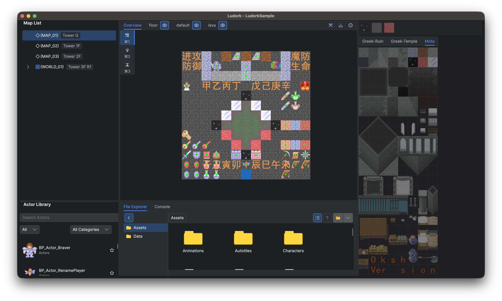
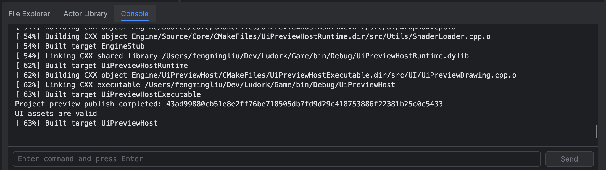

# Start Page, Workspace and Shortcuts

## Goal

Open a project, identify the main workspace regions, use the global shortcuts and find diagnostics before editing project data.

## Safe editing

- Save before Play or Pack. Resolve validation errors at their source.
- Create, rename, copy and move data-aware assets through the editor, so stable identifiers and tracked paths remain valid.
- Use the reference tree to inspect indexed references. Map operations protect only recognised structured references, not arbitrary strings.
- Keep file resources under `Assets`, authored project data under `Data` and runtime code under `Scripts`.
- Review the Console whenever an operation invokes plug-in hooks, native builds or the game process.

## Start page

The Start page lists up to three recently opened projects and provides **New Project** and **Open Project**. Opening a validated `.proj` file moves it to the top of the list. The Start page removes unavailable entries as it loads. Opening `Main.proj` replaces the current project only after the unsaved-work checks succeed.

Dropping an existing `.proj` file anywhere on the Start page opens it. When several files are dropped, the editor uses the first existing `.proj` file and ignores the others.

## Main workspace

The main window contains the map list, map canvas, editing-mode inspector and **World Outliner**, with **File Explorer**, **Actor Library** and **Console** tabs below. Tile, Light and Actor mode controls sit beside the canvas and are hidden for world maps. The toolbar provides **Construct → Export → Play** / **Stop**; Standalone projects hide Construct. See [Running, Testing and Packaging](<08.Run Debug and Package.md>).

The editor uses a compact dark interface with blue selection and focus indicators. Text fields, numeric inputs, menus and toolbars share the same visual style. Map, Tileset, document and lower-panel tabs use consistent spacing and a single blue indicator; hovering an unselected tab shows a translucent indicator. Toolbar icons share a consistent size, and New Project and UI Asset Editor use their window titles without repeating a large heading in the content. Read-only path fields stay outside keyboard navigation.

Resource editors first show a Loading view, then prepare their content in stages. Images load separately, and closing a window cancels its pending work. A failed initialisation offers Retry. General Data pages are cached for each data type, Tileset tabs are initialised once, and collapsed particle sections are created when first expanded. The Animation Overview constructs an editor when the selected animation changes and releases its playback resources when that editor closes.

*The visible inspector and canvas interaction change with the selected editing mode.*

## Global editor preferences

`Ludork.ini` stores preferences shared by all projects and restored when the editor starts again. Existing language, recent-project and main-panel settings remain in `[Ludork]`; additional preferences and layouts use their own sections with stable identifiers.

| Area | Saved preferences |
|---|---|
| Main window | Normal position and size, maximised state, map-list and inspector widths, lower-area height, Actor outliner/inspector proportions and the world-map child-list width. |
| File Explorer | Icon/list view, content zoom, expanded/collapsed source list and preferred external open target. |
| Actor Library | Icon/list view. |
| Map tools | Light mode's **Select Actors** switch. |
| Tool windows | Position, normal size and maximised state for each window type. |
| Tool content | Existing adjustable split widths or proportions, the UI timeline and system-control category expansion, and particle configuration section expansion. |

Tool-window records cover Blueprint, UI, Animation and its Overview, Common Particle and its Overview, Curve, Tileset, Text Config, General Data, Common Functions, Game Variables, System Config, Game Config, Map Properties, Material, struct-field and movement-route editors, plus Documentation, Reference Tree, Performance Monitor and Plug-in Management. Internal split records cover Blueprint properties; UI sidebars, vertical divisions and timeline tracks; particle lists and properties; Text Config; General Data; Game Variables; movement routes; and document navigation. Shared editing controls use the same preferences when hosted in different windows. Start, New Project, confirmation, picker, signing and packaging dialogs retain their existing layouts.

Defaults are icon view in both panels, 100% File Explorer zoom, a collapsed source list, the system file manager and **Select Actors** disabled. Missing or invalid preferences use defaults. Project browsing and map selection stay in `Main.proj`; global preferences do not modify project resources or restore search text, input drafts, layer selection or canvas view state.

Restoring a window respects its size limits and the current monitors' work areas and display scaling, keeping its title bar reachable, including on monitors with negative desktop coordinates. Maximising preserves its normal geometry; minimised state is not restored. The latest user adjustment wins for each window type without moving already-open windows, and closing an older window does not overwrite newer settings. Initialisation, hidden panels and temporary layout changes while a game runs do not replace the saved layout.

Window movement and resizing are saved after 300 ms without another change. Splitter adjustments save when dragging ends or an arrow key changes the split, and preference changes save immediately; pending changes are flushed on exit. Unchanged content is not rewritten. Saving uses a temporary file in the same directory and atomic replacement; a failed write retains the previous file and reports the error. Numeric values use a fixed culture-independent format.

## Global shortcuts

The primary modifier is `Ctrl` on Windows and `Command` on macOS.

| Shortcut | Action |
|---|---|
| `Ctrl/Command+N` | New Project |
| `Ctrl/Command+O` | Open Project |
| `Ctrl/Command+S` | Save |
| `Ctrl/Command+Z` | Undo |
| `Ctrl/Command+Y` | Redo |
| `Ctrl/Command+W` | Exit or close the project window |
| `Ctrl/Command+1` | Tile mode |
| `Ctrl/Command+2` | Light mode |
| `Ctrl/Command+3` | Actor mode |
| `F1` | Ludork Documentation |
| `F3` | Game Config |
| `F4` | System Config |
| `F5` | Animation Overview |
| `F6` | Common Particle Overview |
| `F7` | Tilesets Data |
| `F8` | Common Functions |
| `F9` | Game Variables |
| `F10` | General Data |

Some document windows add context-specific shortcuts. In the Blueprint editor, `F2` renames the selected event tab. In the Common Functions window it renames the selected Common Function, in the file explorer it renames the selected file, except on macOS, and in the animation editor it renames the selected time tag. No window displays an `F2` hint.

Single-button hint and error dialogs close with `Enter`, `Return`, `Space` or `Escape`. In confirmation dialogs, `Enter`, `Return` and `Space` confirm the action, while `Escape` cancels it.

## Editing and saving

Displayed field defaults are written only when the field is edited.

Managed resource changes stay in memory until Save. All Save buttons and `Ctrl/Command+S` write every modified document, including unopened resources, and Construct, Export, Play and Pack use the same workflow. Normal Save validates changed Blueprints, while forced saving can retain unfinished graphs. [Game Config](<02.Project Settings and Asset Layout.md#mainini>) writes immediately on confirmation.

Undo and Redo apply only to the active file, which keeps its 100 most recent entries. Windows that show the same file share its data and history, including after they are closed and reopened. Continuous text or numeric input in one field merges into a single step. Changing the control or the editing view, an automatic update, Save, Undo and Redo all end that step. Buttons, check boxes and selections each remain separate steps.

Ordinary Undo and Redo restore the active document without rebuilding the project reference index. If resources have been deleted during the project session, the editor checks the candidate document and its resolution dependencies before restoring it. A step that would restore a reference to a deleted resource is rejected without changing the document or its history. Map edits refresh the affected map and retain the selected map, surviving layer selection and viewport; unrelated resource edits do not rebuild the map list or discard cached map images.

Automatic reference updates create a marked Undo barrier in every changed target file, including unopened files. Later edits remain undoable, but Undo cannot cross the barrier and reports the barrier's source. Undoing or redoing the source rename updates references against the current target content and adds a new barrier, which preserves unrelated edits. Saving preserves the history and the barriers, so Undo can mark a saved file as modified again.

Modified files show `*` in the file explorer and in editor titles, and they are marked in resource selectors. Closing or replacing a project lists unsaved files and offers **Save**, **Discard** and **Cancel**. **Save** writes every modified document. Save failures retain the modified markers and prevent closing. Closing a resource window keeps its unsaved data until the project closes.

## File explorer and reference tree

File Explorer browses `Assets` and `Data` through the source sidebar and breadcrumbs. Up stops at the selected root. The last valid browsing directory is restored, defaulting to `Assets`.

Right-click an entry for file operations or empty space for the current directory’s menu. Paste shortcuts target the current browsing directory.

In list view, folder arrows expand or collapse nested folders in place; double-click a folder to enter it. `Right` expands a folder or selects its first child; `Left` collapses it or selects its parent. Expansion is remembered for the project session. Icon view and search results remain flat.

Search matches file names in the current directory and its subdirectories, ignoring case. Results include unsaved resources and display relative paths. Clearing the field restores browsing; changing directories or locating a file clears the search. Symbolic-link folders are excluded from expansion and recursive search.

Use `Ctrl/Command` with the mouse wheel or the bottom-right slider to scale icons and text from 50% to 200%. Press F5 to refresh external file changes.

Previews load progressively; animated previews play only for visible entries.

The file explorer manages project files and creates Blueprint, Animation, Common Particle, Curve, Text Config and UI assets. The reference tree shows incoming and outgoing references. Map operations update or guard recognised indexed references atomically, and arbitrary strings remain unmanaged.

The project keeps one reference index in memory, builds it on first use and maintains it thereafter. The reference tree builds and refreshes in the background, combining changes within 150 ms. It shows a loading state initially and retains the previous graph with an updating indicator during refresh; successful refreshes preserve pan and zoom. A failed refresh displays an error. Deletion and rename checks synchronously catch up with current project data, so an older displayed graph cannot authorise a resource operation.

Creating or copying a managed resource leaves it unsaved and adds no Undo step for the creation. A rename appears immediately in the editor. Global Save then writes the new paths and the updated references together. Deletion requires every recognised reference to be removed and saved first. Confirmed deletion is immediate and cannot be undone.

Copy/paste name conflicts produce names such as `name_copy.ext`, then `name_copy2.ext`, without overwriting existing files or folders.

The open menu at the upper right always offers the system file manager, which opens the current browsing directory. Selecting an entry saves it as the preferred open target. If it is unavailable in another project or on the current machine, the button uses the system file manager while retaining the saved preference. It lists VS Code or Cursor only when the corresponding application is installed. C++ Source projects also list an installed CLion, and Visual Studio 2022 on Windows. VS Code, Cursor and CLion open the project root regardless of the directory displayed in the file explorer. When the local `.idea` or `.vs` configuration is absent, opening CLion or Visual Studio for the first time prompts before running the project-provided environment generator. Cancelling leaves the project unchanged. Visual Studio opens the generated `Main.sln` at the project root.

## Console and performance monitor

The Console collects plug-in, build and runtime output. Input can be sent only while a compatible runtime connection is ready. **Edit → Development Tools and Settings → Performance Monitor** displays recent frame, logic and memory samples while the game is running.

### World-streaming samples

When profiling a composite world, the Performance Monitor includes an optional `worldStreaming` snapshot. Ordinary-map and unprofiled ticks do not include it.

| Field | Meaning |
|---|---|
| `queueDepth` | Child regions waiting in the streaming queue. |
| `reading` | Regions currently in `Reading`. |
| `prepared` | Loaded regions in `Prepared`. |
| `active` | Regions in `Active`. |
| `dormant` | Loaded regions in `Dormant`. |
| `cacheBytes` | Conservative estimate used by the non-Active region cache. It is not exact process, Lua, native or GPU memory. |
| `publishMilliseconds` | Time spent converting and publishing regions during the logic tick. |
| `visibleTileChunks` | Unique 32×32-cell TileLayer chunks submitted by visible child layers in the latest draw. |
| `activeActors` | Actors currently present in the world's Active update/render batches. |

*The Console records launch progress, runtime diagnostics and the final process result.*

*A waiting monitor is normal when no compatible runtime session is active; the timeline fills after telemetry is connected.*

## Limitations

Context-specific windows can assign additional shortcuts, but they do not change the global `F3`–`F10` mapping.

## Related pages

- [Common Particles](<10.Common Particles.md>)
- [Project Settings and Asset Layout](<02.Project Settings and Asset Layout.md>)
- [Running, Testing and Packaging](<08.Run Debug and Package.md>)
