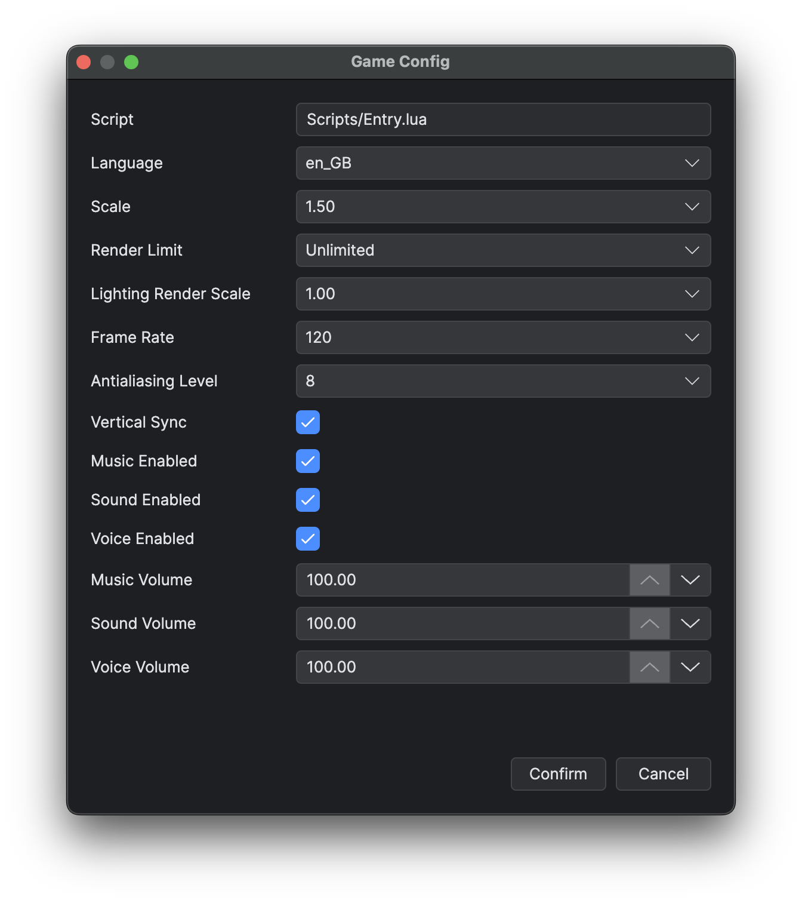

# Project Settings and Asset Layout

```text
MyGame/
├── Main.proj
├── Main.ini
├── Assets/
├── Data/
│ ├── Animations/
│ ├── AutoTiles/
│ ├── Blueprints/
│ ├── CommonFunctions/
│ ├── Configs/
│ ├── Curves/
│ ├── General/
│ ├── Locale/
│ ├── Maps/
│ │ ├── Map_01.json
│ │ └── World_01/
│ │   ├── _world.json
│ │   ├── Map_01.json
│ │   └── Map_02.json
│ ├── TextConfigs/
│ ├── Tilesets/
│ └── UI/
├── Scripts/
│ ├── Entry.lua
│ ├── Global/
│ ├── Mixins/
│ ├── Source/
│ │ ├── Configs/
│ │ ├── Locale/
│ │ └── UI/
│ ├── stub/
│ ├── Engine_meta.lua
│ ├── GlobalCore_meta.lua
│ └── GlobalFunctions_meta.lua
└── Engine/
```

C++ Source templates keep `CMakeLists.txt`, `src/` and `include/` at the project root. `Engine/` groups `Runtime/`, `Standard/`, `Source/{Core,Global,GlobalFunctions}/`, third-party dependencies in `ThirdParty/`, platform hosts in `PlatformHosts/` and build support in `cmake/`. FFmpeg source archives reside in top-level `ThirdPartySource/`. Standalone templates contain resources, licences and the packaged runtime. See [Build and Module Layout](<../04.Native C++ Development/01.Build and Module Layout.md>).

## Main.proj

`Main.proj` describes editor and packaging capabilities. The Sample enables the C++ runtime and FFmpeg and stores the preferred run-window mode:

```json
{
  "Cpp": true,
  "ffmpeg": true,
  "IndividualWindow": true,
  "lastFileExplorerPath": "Data/Blueprints/Actors"
}
```

Treat unknown keys as editor-owned state and preserve them. Select the FFmpeg template consistently with the `ffmpeg` setting.

## Main.ini

`Main.ini` stores game-facing settings. Open **Game → Game Config** (F3) to edit Language, Scale, Render Limit, Lighting Render Scale, frame timing and audio values. The entry script is read-only. **Confirm** marks the project as changed; the normal Save action writes the values to `Main.ini`.



*Check the entry script, language and display settings before adjusting the three audio channels.*

Scale appears only when the runtime host supports it. Editor runs use the project copy of `Main.ini`; packaged games keep mutable settings in platform user data. See [Game Settings Reference](<../03.Lua and Blueprint Scripting/06.Sample Gameplay/07.Game Settings Reference.md>) for keys, choices, defaults and application timing.

## Assets

Authoring files live under the physical `Assets` directory. Stored resources use exact-case `/Game/Assets/...` paths with `/` separators and file extensions; `Assets/...`, category-relative, native absolute and traversal paths are invalid. `PathVars` and Config `base` only constrain selectors. `/Game` works through Ludork resource APIs, while Standard filesystem APIs and direct LuaSF file constructors use native paths.

Keep conventional first-level folders so selectors can filter correctly: `Tilesets`, `Autotiles`, `Characters`, `Animations`, `Icons`, `Fonts`, `Musics`, `Sounds`, `Voices`, `Shaders`, `Fogs`, `Transitions`, `System` and `Videos`. Custom groups are valid unless their names end in `.ldpak`. **Use .ldpak** creates one archive per group and rejects ordinary files directly under `Assets`.

Moving an asset does not automatically repair every stored reference. Open its reference tree before moving or deleting it, then update affected data manually.

## Data and Scripts

`Data` contains JSON authored by the editor; `Data/Locale/Locale.xlsx` is the localisation workbook managed by Official Locale Tools. Declarative UI assets live under `Data/UI/Assets`; `Data/TextConfigs` holds shared or specialised text styles while ordinary UI text styles are stored on their UI nodes. `Scripts` contains runtime Lua, generated Core metadata and LuaLS declarations. `Scripts/Global` holds shared runtime modules such as `GameMap` and `Pool`, `Scripts/Source` holds gameplay classes and UI controllers, and generated language modules live under `Scripts/Source/Locale`. File-layer ownership (`.lua`, `stub/**/*.d.lua`, `_meta.lua`) is in [Lua Runtime and Modules](<../03.Lua and Blueprint Scripting/01.Lua Runtime and Modules.md>).

The Game Variable Manager owns `Scripts/Source/Configs/GameVariables.lua` and `GameVariables_meta.lua`. General Data Save owns `Scripts/Source/Configs/GeneralEnum.lua` and `Scripts/stub/Source/Configs/GeneralEnum.d.lua`. All four are generated; do not edit them by hand. Their regeneration is described in [General Data and Text Config](<05.General Data and Text Config.md>).

Do not edit `Engine_meta.lua`, `GlobalCore_meta.lua`, `GlobalFunctions_meta.lua` or generated Core/LuaSF declarations by hand. Packaging removes `Scripts/stub` and rejects any misplaced `.d.lua`.

Projects keep loose `Data` and `Scripts` while authoring. **Use .ldpak** changes only staging: each first-level Data group becomes an archive and the pruned runtime scripts become `Scripts.ldpak`; development declarations are never included. See [Run, Debug and Package](<08.Run Debug and Package.md>) for validation rules.

### Map and world-map assets

An ordinary map is `Data/Maps/<Name>.json`. A world is `Data/Maps/<WorldFolder>/` with exactly one `_world.json` and direct child-map `.json` files; no deeper nesting is allowed. World loading reads only direct `.json` files and ignores other regular files such as `.DS_Store`. The folder name is the world's path identity, while `_world.json` stores its independent `worldName`. Each direct child keeps its own editable `mapName` so the file remains a complete map if moved out of the world; the child filename remains its path and placement identity. The manifest is the world's selector/save identity and stays hidden in the Map List.

The manifest has this closed editor-owned shape:

```json
{
  "type": "worldMap",
  "worldName": "{WORLD_01}",
  "width": 256,
  "height": 192,
  "fog": "",
  "fogPower": 0,
  "fogOx": 0.0,
  "fogOy": 0.0,
  "fogDistort": 0,
  "layerOrder": ["floor", "default"],
  "placements": [
    {
      "map": "Map_01.json",
      "rect": [0, 0, 64, 64]
    }
  ]
}
```

`width`, `height` and `[x, y, width, height]` placement rects use zero-based cells. A rect must match its child size; each child may appear once, placements may touch but not overlap or leave the world, and uncovered cells are valid holes.

`worldName` is a required non-empty display name. `layerOrder` is derived from placed children and rejects contradictory cycles. The manifest owns the world display name, size, composition and global fog; audio, filters and ambient light remain child data.

## Limitations

Map rename/move handling rewrites only recognised structured map references: Config settings whose `type` starts with `file` and whose selection root is exactly `root = Data`, `base = Maps`, plus `params[0]` on graph nodes whose `nodeFunction` ends in `.GotoMap` or `.RecordTelepoint`. Other string-based runtime references are not inferred or rewritten.

## Related pages

- [Project Templates](<../01.Getting Started/02.Project Templates.md>)
- [Lua Runtime and Modules](<../03.Lua and Blueprint Scripting/01.Lua Runtime and Modules.md>)
- [Run, Debug and Package](<08.Run Debug and Package.md>)
