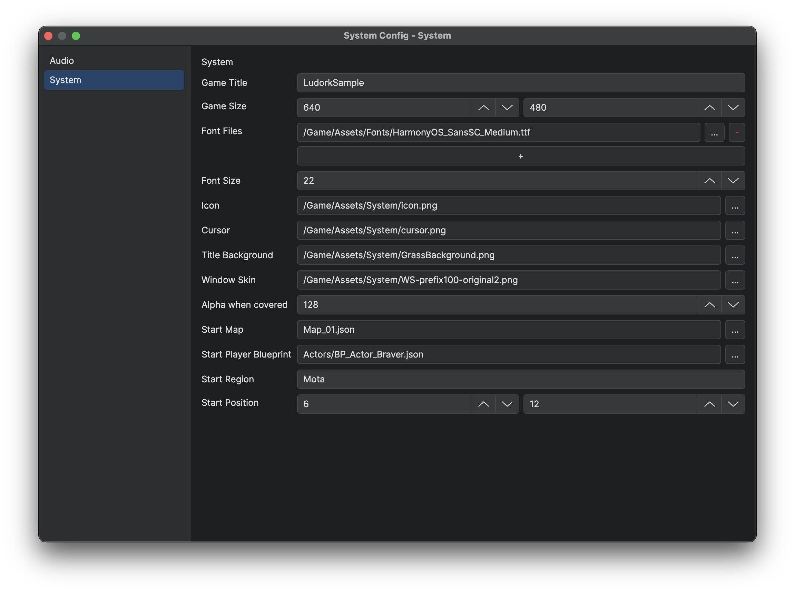

# Project Settings and Asset Layout

A project combines editor and packaging capabilities in `Main.proj`, game-facing runtime settings in `Main.ini`, file resources under `Assets`, authored data under `Data` and runtime code under `Scripts`. C++ Source templates keep `CMakeLists.txt` at the project root and place the game host under `Application/include/` and `Application/src/`. `Engine/` groups `Runtime/`, `Standard/`, `Source/{Core,Global,GlobalFunctions}/` and `UiPreviewHost/`, together with third-party dependencies in `ThirdParty/`, platform hosts in `PlatformHosts/` and build support in `cmake/`. FFmpeg source archives reside in the top-level `ThirdPartySource/`. Standalone templates contain resources, licences and the packaged runtime. See [Build and Module Layout](<../04.Native C++ Development/01.Build and Module Layout.md>).

## Main.proj

`Main.proj` describes editor and packaging capabilities. The Game project enables the C++ runtime and FFmpeg and stores the preferred run-window mode:

```json
{
  "Cpp": true,
  "ffmpeg": true,
  "IndividualWindow": true,
  "lastFileExplorerPath": "Data/UI/Assets"
}
```

Treat unknown keys as editor-owned state and preserve them. Choose the FFmpeg template to match the `ffmpeg` setting.

The editor stores the last selected map key in `lastOpenedMapKey` and saves it immediately when the editing selection changes, without saving map content. Reopening the project restores that map, including world maps and their child maps. Missing or invalid records select the first available entry; an empty project has no selection. Live-debug map changes do not overwrite this preference.

## Main.ini

`Main.ini` stores game-facing settings. Open **Game → Game Config** (`F3`) to edit them. The dialog presents fourteen rows in this order: script (read-only), language, scale, render limit, lighting render scale, frame rate, antialiasing level, vertical sync, music enabled, sound enabled, voice enabled, music volume, sound volume and voice volume.

**Confirm** writes `Main.ini` atomically, and only when a value differs from the stored configuration, so an unchanged confirmation writes nothing. The current configuration is updated only after the write succeeds. Write failures keep the dialog open with an error, and **Cancel** writes nothing. Game Config is excluded from document Undo and unsaved state.


*Check the entry script, language and display settings before adjusting the three audio channels.*

Game Config always shows Scale in the editor. The in-game Config window shows that row only when `System.isDisplayScaleConfigurable()` reports that the host supports display scaling.

Editor runs use the project copy of `Main.ini`. A packaged Windows desktop game writes `Main.ini` and `Save/` into its runtime root, beside `Assets`, `Data` and `Scripts`, because Windows resolves user data to the process working directory. macOS and Linux desktop builds use `$HOME/<AppName>`, iOS uses `~/Library/Application Support/<AppName>`, and HarmonyOS and Android use the app-private user-data root. See [Game Settings Reference](<../03.Lua and Blueprint Scripting/05.Default Gameplay/07.Game Settings Reference.md>) for the keys, choices, defaults and application timing.

## System Config

Open **Database → System Config** (`F4`) to edit the configuration files under `Data/Configs`. The left-hand list shows each configuration by its relative key; selecting an entry such as **Audio** or **System** displays only that configuration's fields on the right.

Discovery follows the existing rules: recursively read `*.json` files under `Data/Configs`, ordered by path, and use extensionless relative paths as keys. JSON objects with `type: "system"` or no `type` are accepted; other types, malformed JSON and animation-cache files do not become configuration entries. File-picker roots and extension filters still come from each field's existing `root`, `base` and `ext` settings.

Switching configurations keeps pending edits and does not save automatically. An asterisk in the list and window title marks changes. Use Ctrl+S on Windows or Command+S on macOS for global Save; Undo/Redo applies to the configuration selected in the list.



*Select System to edit the game's title, dimensions and startup settings, or Audio to edit sound and music resources.*

## Assets

Authoring files live under the physical `Assets` directory. Stored resources use exact-case `/Game/Assets/...` paths with `/` separators and file extensions. Paths such as `Assets/...`, category-relative paths, native absolute paths and traversal paths are invalid. `PathVars` marks a field as a validated canonical `/Game/Assets/...` reference, unless `PathRoot = "Project"` exempts it. Config `base` only sets the picker root. `/Game` works through Ludork resource APIs, while Standard filesystem APIs and direct LuaSF file constructors use native paths.

Keep the conventional first-level folders so that selectors can filter correctly: `Tilesets`, `Autotiles`, `Characters`, `Animations`, `Particles`, `Icons`, `Fonts`, `Musics`, `Sounds`, `Voices`, `Shaders`, `Fogs`, `Panoramas`, `Transitions`, `System` and `Videos`. The `.ldpak` option archives the complete `Assets` tree as root `Assets.ldpak`, including ordinary files directly under `Assets`. Logical resource paths remain unchanged.

Moving an asset does not automatically repair every stored reference. Open its reference tree before moving or deleting it, then update the affected data manually.

## Data and Scripts

`Data/Particles` stores [Common Particle](<10.Common Particles.md>) definitions. A particle reference is its extensionless relative key; particle textures use complete logical paths, conventionally under `/Game/Assets/Particles`.

`Data` contains JSON authored by the editor, and `Data/Locale/Locale.xlsx` is the localisation workbook managed by Official Locale Tools. Declarative UI assets live under `Data/UI/Assets`, while `Data/TextConfigs` holds shared or specialised text styles. Ordinary UI text styles are stored on their UI nodes.

`Scripts` contains runtime Lua, generated Core metadata and LuaLS declarations. `Scripts/Global` holds shared runtime modules such as `GameMap` and `Pool`, and `Scripts/Source` holds gameplay classes and UI controllers. Generated language modules live under `Scripts/Source/Locale`. `Scripts/Source/UI` and its mirrored stubs are generated from UI JSON, while handwritten foundations belong in `Source.UIBase`. UI file ownership is described in [Declarative UI Authoring Workflow](<../03.Lua and Blueprint Scripting/04.Declarative UI/01.Authoring Workflow.md>), and file-layer ownership (`.lua`, `stub/**/*.d.lua`, `_meta.lua`) is in [Lua Runtime and Modules](<../03.Lua and Blueprint Scripting/01.Lua Runtime and Modules.md>).

`Scripts/Source` contains `Configs/`, `Locale/`, `UI/`, `UIBase/`, `Windows/`, `Scenes/`, `SceneComponents/`, `Components/`, `Data/`, `Enemy/`, `GameInstance/`, `Gameplay/`, `NodeFunctions/` and `Utils/`.

The Game Variable Manager owns two files, `Scripts/Source/Configs/GameVariables.lua` and `GameVariables_meta.lua`. General Data Save owns four: `Scripts/Source/Configs/GeneralEnum.lua`, `Scripts/stub/Source/Configs/GeneralEnum.d.lua`, `Scripts/Source/Configs/GeneralDataTypes.lua` and `Scripts/stub/Source/Configs/GeneralDataTypes.d.lua`. All six files are generated, so do not edit them by hand. Their regeneration is described in [General Data and Text Config](<05.General Data and Text Config.md>).

Do not edit `Engine_meta.lua`, `GlobalCore_meta.lua`, `GlobalFunctions_meta.lua` or generated Core/LuaSF declarations by hand. Packaging removes `Scripts/stub` and rejects any misplaced `.d.lua`.

Projects keep loose `Data` and `Scripts` while authoring. The `.ldpak` option changes only staging: the complete Data tree becomes root `Data.ldpak`, and the pruned runtime scripts become root `Scripts.ldpak`. Development declarations are never included. See [Running, Testing and Packaging](<08.Run Debug and Package.md>) for the validation rules.

### Map and world-map assets

An ordinary map is `Data/Maps/<Name>.json`. A world is `Data/Maps/<WorldFolder>/` with exactly one `_world.json` and direct child-map `.json` files, and deeper nesting is not allowed. World loading reads only the direct `.json` files and ignores other regular files such as `.DS_Store`. The folder name is the world's path identity, while `_world.json` stores its independent `worldName`. Each direct child keeps its own editable `mapName`, so the file remains a complete map after it is moved out of the world, and the child file name remains its path and placement identity. The manifest is the world's selector and save identity, and it stays hidden in the Map List.

The manifest has this closed editor-owned shape:

```json
{
  "type": "worldMap",
  "worldName": "{WORLD_01}",
  "width": 256,
  "height": 192,
  "fog": "",
  "fogPower": 0,
  "fogOx": 0.0,
  "fogOy": 0.0,
  "fogDistort": 0,
  "panorama": "",
  "layerOrder": ["floor", "default"],
  "placements": [
    {
      "map": "Map_01.json",
      "rect": [0, 0, 64, 64]
    }
  ]
}
```

`width`, `height` and `[x, y, width, height]` placement rects use zero-based cells. A rect must match the size of its child, and each child may appear once. Placements may touch, but they cannot overlap or extend beyond the world, and uncovered cells are valid holes.

`worldName` is a required non-empty display name. `layerOrder` is derived from the placed children and rejects contradictory cycles. The manifest owns the world display name, size, composition, global fog and global panorama, while audio, filters and ambient light remain child data.

## Limitations

Map rename and move handling rewrites only recognised structured map references. These are Config settings whose `type` starts with `file` and whose selection root is exactly `root = Data`, `base = Maps`, plus `params[0]` on graph nodes whose `nodeFunction` ends in `.GotoMap` or `.RecordTelepoint`. Other string-based runtime references are not inferred or rewritten.

## Related pages

- [Project Templates](<../01.Getting Started/02.Project Templates.md>)
- [Lua Runtime and Modules](<../03.Lua and Blueprint Scripting/01.Lua Runtime and Modules.md>)
- [Running, Testing and Packaging](<08.Run Debug and Package.md>)
