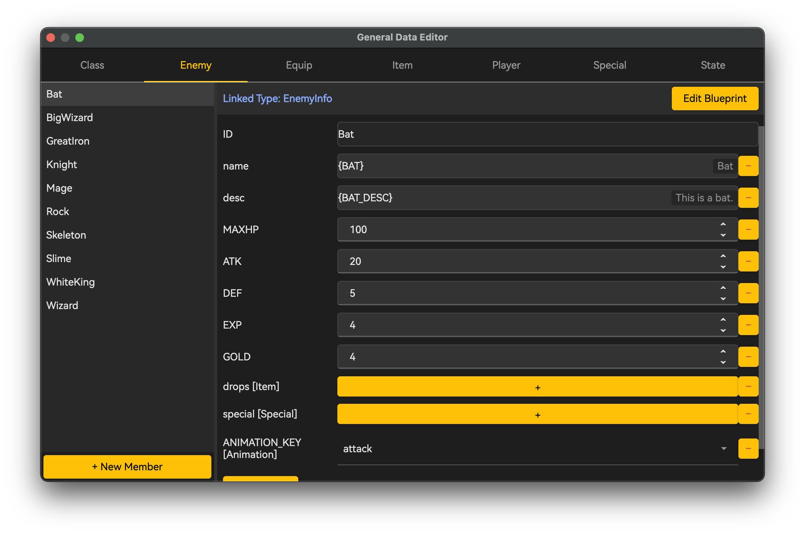
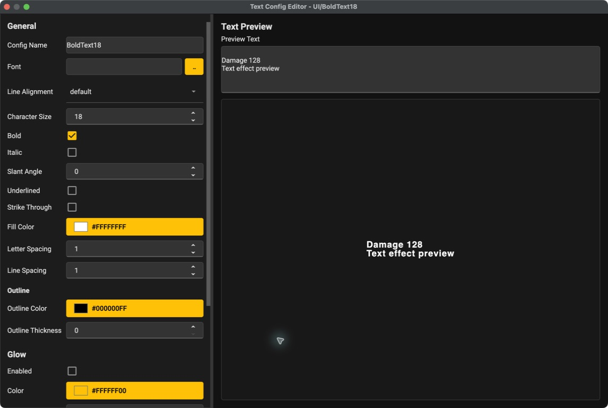

# General Data

General Data is the editor-managed database beneath `Data/General`. Each JSON file defines a type schema and named members. It is suited to enemies, items, equipment, player presets, states and other data shared by many maps or Blueprints.

## Goal

Define a reusable data schema, enter validated members and create Text Config without breaking existing runtime references.

## Prerequisites

- A saved project and a planned stable name for each type and member.
- The field types, defaults and reference targets required by runtime consumers.
- A backup before changing a schema that already has members.

## Type structure

| Key | Meaning |
|---|---|
| `params` | Ordered field definitions with `type`, `defaultValue`, optional description and reference selector |
| `members` | Named records that store values for those fields |
| `linkedType` | Optional runtime metadata type used by graph events and conversions |
| `events` | Optional ordered event names; each member may store a graph for them |

Supported editor fields include strings, booleans, integers, floating-point values, files, lists and dictionaries. A reference declaration narrows a value to another General Data type, an animation or another supported resource.

## Steps

1. Open **Database → General Data** (F11).
2. Select or create a type.
3. Define fields before creating many members.
4. Add members and fill their values.
5. For a type with events, edit each member's graph.
6. Inspect references before renaming or deleting types and members.
7. Save and exercise the runtime path that reads the data.

Changing a field type after data exists may invalidate stored values. Removing a field removes its meaning but does not automatically repair scripts that read it.

*Define the schema before entering records so every member uses the intended field types.*

## Text Config

Open **Game → New Text Config** (F6) to create structured text configuration data. Keep keys stable after scripts or assets begin to reference them, validate the saved JSON, and exercise the runtime consumer after each schema change.

*Text Config provides a focused editor for structured text data used by the project.*

Brace-wrapped display values such as `{ITEM_NAME}` are consumed by the game localisation workflow. Their table format and runtime resolution are documented only in Plugin System and Localisation.

See General Data Reference for the exact Sample schemas.

## Expected result

Every member follows the declared field order and types, selectors resolve valid targets, Text Config saves valid structured data, and runtime consumers read the expected values.

## Verification

- Reopen the type and compare member values with the schema.
- Inspect the reference tree before renaming or deleting an identifier.
- Run every event or script that consumes a changed field.
- Validate localisation hints separately from stored identifiers.

## Limitations

Changing a schema cannot automatically repair scripts, graphs or string references. General Data is project definition data, not a store for mutable play-session state.

## Related pages

- [General Data Reference](<09.General Data Reference/00.Overview.md>)
- [Blueprints, Common Functions and Actors](<04.Blueprints Common Functions and Actors.md>)
- [Game Localisation Workflow](<../05.Plug-in Development and Installation/06.Game Localisation Workflow.md>)
