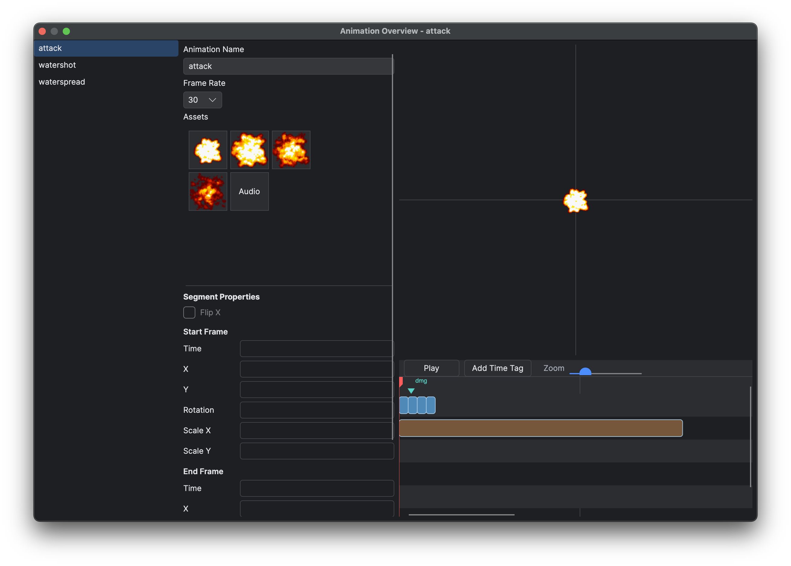
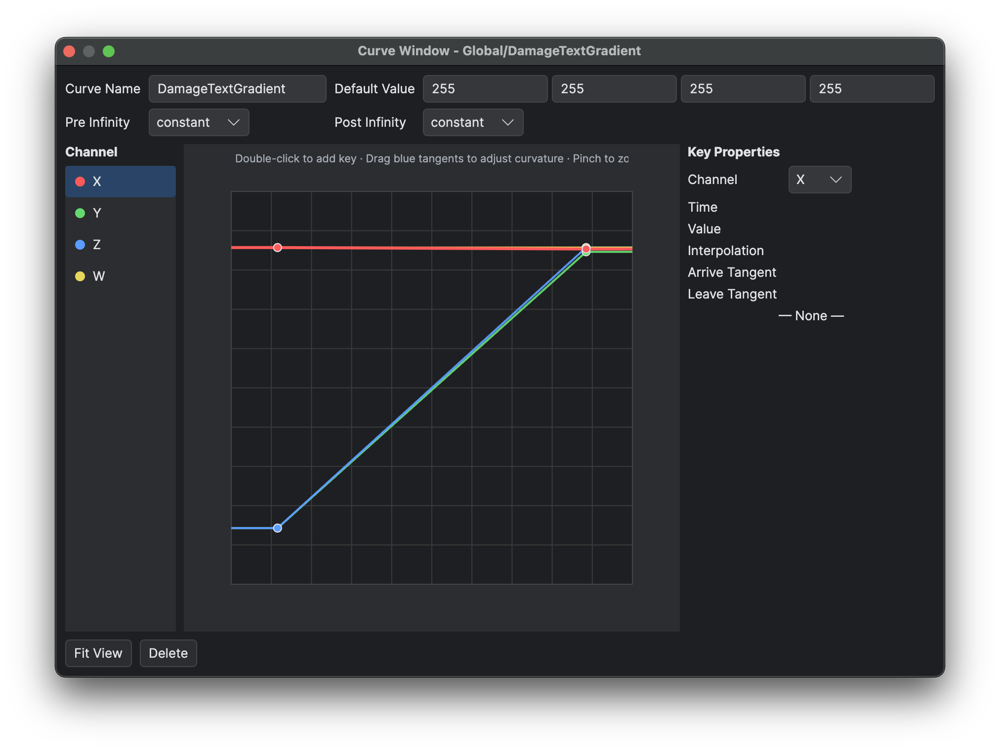

# Animations and Curves

## Goal

Create animation and curve assets, preview their timing, and reference their stable project keys from data or scripts.

## Animations

Open **Database → Animation Overview** (F5) to browse animation data. **Game → New Animation** creates a JSON asset beneath `Data/Animations`. The editor exposes the animation format's frames, timing, visual resources and event data.

Keep source images beneath `Assets/Animations` or another intended asset folder. Preview timing before relying on an animation's duration in gameplay. Runtime helpers distinguish total duration from visual duration where appropriate.

*Preview animation frames, timing and events before using the asset in gameplay.*

## Curves

**Game → New Curve** creates a curve beneath `Data/Curves`. A curve has a name, default value, pre/post infinity behaviour and ordered keys. Each key contains time, value, interpolation and arrive/leave tangents.

Use the curve editor to add, move and remove keys. Keep key times ordered and avoid duplicate times unless the intended interpolation explicitly supports the discontinuity.

*Inspect curve keys and interpolation before referencing the curve in gameplay.*

## Referencing data

Metadata-driven selectors can reference animation and curve keys from Blueprints or General Data. Renaming the JSON file changes the logical key derived from its path, so inspect the reference tree first.

## Testing

Test zero-key and one-key curves, animation completion, frame events and transitions at the target frame rate. Curves used for fades or movement should also be checked at low and high frame rates.

## Related pages

- [Project Settings and Asset Layout](<02.Project Settings and Asset Layout.md>)
- [Blueprint Scripting](<../03.Lua and Blueprint Scripting/04.Blueprint Scripting/01.Execution Flow Events and Variables.md>)
