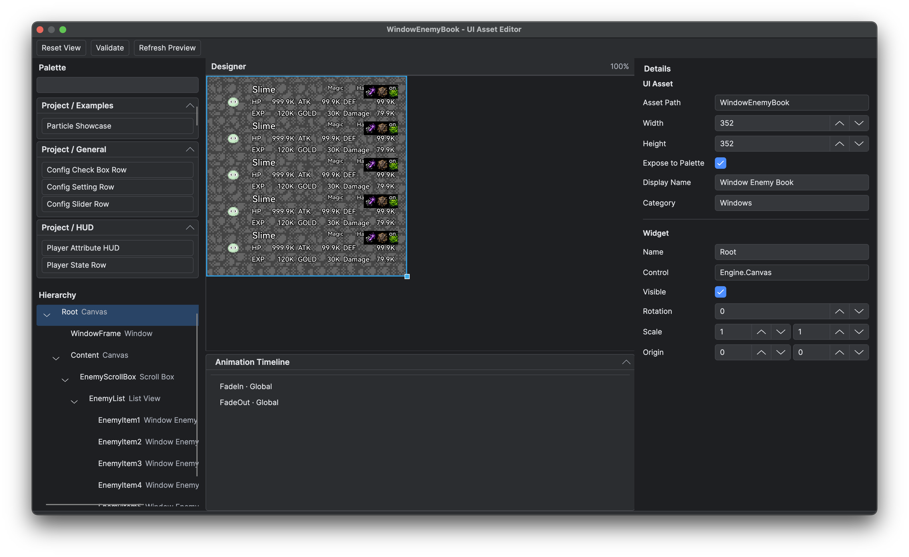

# UI Asset Editor

## Goal

Create and arrange a declarative UI asset without writing its runtime Controller.

## Prerequisites

- Planned asset ownership: complete UI, owner-specific part or shared part.

## Open or create an asset

Choose **Game → New UI Asset**, or create/open a JSON asset beneath `Data/UI/Assets` from the project file explorer. Asset ownership (`Parts/<Owner>` versus `Shared`) is in [Declarative UI Authoring](<../03.Lua and Blueprint Scripting/05.Declarative UI/01.Authoring Workflow.md>).

*The UI Asset Editor separates available controls, tree structure, visual placement and selected-node properties.*

## Steps

1. Set the design width and height for the asset.
2. Add a root control. A new screen normally starts with `Engine.Canvas`.
3. Drag system controls or exposed project assets from the Palette into the Hierarchy.
4. Select each node and edit control properties in the Inspector.
5. Configure the child Slot. Canvas children use anchors, offsets, alignment, auto-size and z-order; List children use list-owned placement.
6. Give every node a meaningful name that is unique within the asset. Runtime Controllers use these names for lookup.
7. Set **Exposed** only when the asset is a complete, reusable item that should appear in the Project Palette.
8. Save and review validation results.

## Asset paths and node names

The asset identity is the exact-case path relative to `Data/UI/Assets`, with forward slashes and no extension. Moving or renaming an asset rewrites managed JSON nesting references; update the matching `Ui.define`, `require` and LuaDoc paths manually. The full key contract is in [Asset Schema](<../03.Lua and Blueprint Scripting/05.Declarative UI/04.Asset Schema and Control Registry.md>).

## Preview behaviour

The Designer uses native preview when the matching `UiPreviewHost` and adapter fingerprint are available. If native preview is unavailable, the editor reports the reason and uses its supported fallback. Design-only `previewText` helps place localised or runtime-generated text; the runtime ignores every `editor` object.
