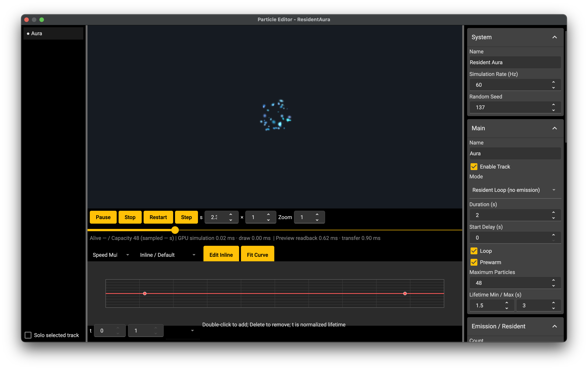

# Common Particles

Common particle assets describe ordered GPU emitter tracks. An Actor uses an `EmitterComponent`, and a UI uses an `Engine.EmitterView` node. Both use the same `Emitter` playback implementation. Existing `Particle`, `TextParticle` and `ParticleSystem` remain available independently.

## Author and preview

Choose **Game → New Common Particle** or create a particle in the project file explorer. **Database → Common Particle Overview** (`F6`) lists the resources under `Data/Particles`. Select a resource to edit its tracks, properties and lifetime curves. Right-click the track list to add a track; right-click a track to select it and enable Duplicate Track and Remove Track for that item. Those two actions are disabled when opening the menu on empty space. The preview can isolate the selected track. Track order also determines drawing order within an emitter.



*The track list is on the left, the preview and lifetime curve are in the centre, and properties are on the right.*

The renderer's Texture Rect has a Position row for X/Y and a Size row for width/height. The properties pane starts at the measured width required by its labels and inputs, including complete numeric values. It takes that space from the central preview while keeping the window width unchanged. The splitter can widen the pane but cannot shrink it below its content requirement; expanding a section or changing a value updates that requirement. If the content cannot fit within the available window width, the pane stays inside the window and provides horizontal scrolling.

The preview supports Play/Pause, Stop, Restart, one simulation step, time entry, dragging the time slider, playback speed and zoom. A step advances `1 / simulationRate` seconds. Seeking pauses playback and reconstructs the selected time by replaying the GPU simulation from the beginning; it does not read particle state back to the CPU. Long seeks therefore cost more than nearby playback. Preview controls do not modify the saved resource.

Resource edits follow the normal in-memory document workflow: manual Save, shared views of the same file, and the active file's most recent 100 Undo/Redo entries. Changing a resource refreshes its preview. The project's native preview runtime must be ready and match its registry; an unsupported GPU capability or a missing resource is reported as an error.

## Resource identity and schema

Store definitions in `Data/Particles/<key>.json`. References use the exact-case key with `/` separators and no directory prefix or extension, for example `Combat/Hit`. Textures use complete `/Game/Assets/...` logical paths. Definitions have no version field.

This schema is the resource-file and editor JSON format. Runtime code uses the fixed fields of `EmitterConfiguration`, `EmitterTrack`, `EmitterCurves` and `EmitterBurst` through `setConfiguration` and `getConfiguration`. The loader converts string choices to boolean/integer properties, divides RGBA values by 255, constructs SFML vectors/rectangles and resolves curve resource keys into `CurveData`. The [Emitter configuration API](<../03.Lua and Blueprint Scripting/08.Global and Core Modules/02.Core Modules/01.Engine/08.Time Rendering and Particles.md#emittertrack>) lists the mappings. Keep the JSON names and 0–255 colour units when authoring files; the editor continues to use this format and its existing preview messages.

```json
{
  "type": "particle",
  "simulationRate": 60,
  "seed": 1,
  "tracks": [
    {
      "name": "Glow",
      "mode": "resident",
      "capacity": 64,
      "count": 32,
      "loop": true,
      "shape": "disk",
      "radius": 24,
      "lifetime": [0.8, 1.6],
      "speed": [4, 12],
      "texture": "/Game/Assets/Particles/Glow.png",
      "blend": "add",
      "curves": {
        "alpha": {
          "keys": [
            { "time": 0, "value": 0 },
            { "time": 0.2, "value": 1 },
            { "time": 1, "value": 0 }
          ]
        }
      }
    }
  ]
}
```

This example requires the named texture in the project. An empty texture is transparent. `simulationRate` is an integer from 1 to 240, default 60; `seed` is an integer from 0 to 16,777,215, default 1. `tracks` is an ordered array with unique track names. A fixed seed supports repeatable authoring on the same runtime and GPU; floating-point GPU simulation is not a cross-device determinism guarantee.

| Track fields | Default and meaning |
|---|---|
| `name`, `enabled` | `"Track"`, `true`; names identify tracks for manual emission. |
| `mode` | `"emission"` or `"resident"`; see the lifecycle rules below. |
| `duration`, `delay`, `loop`, `prewarm` | `2`, `0`, `true`, `false`; timing uses seconds. `duration` is positive and `delay` is non-negative. |
| `capacity`, `count` | `1024`, `min(32, capacity)`; capacity is 1–1,000,000, and resident count is 0–capacity. |
| `rate`, `distanceRate`, `bursts` | `30`, `0`, `[]`; particles per second, particles per logical pixel of host motion, and scheduled bursts. |
| `shape`, `extent`, `radius`, `innerRadius` | `"point"`, `[32,32]`, `16`, `8`; shapes are `point`, `line`, `rectangle`, `disk`, `ring`. A line uses `extent.x`; rectangles use both extents. Radii are non-negative, and a ring's inner radius cannot exceed its outer radius. |
| `direction`, `spread` | `-90`, `30` degrees; initial direction is sampled within `direction ± spread`. Positive Y points down. |
| `lifetime`, `speed` | `[1,2]` seconds, `[20,40]` logical pixels/second; arrays contain minimum and maximum values. Lifetime is positive. |
| `sizeMin`, `sizeMax` | `[8,8]`, `[16,16]` logical pixels; non-negative minimum/maximum size for each axis. |
| `rotation`, `angularVelocity` | `[0,360]` degrees, `[0,0]` degrees/second. |
| `colourMin`, `colourMax` | Both `[255,255,255,255]`; minimum/maximum RGBA components in 0–255. |
| `gravity`, `radialAcceleration`, `tangentialAcceleration`, `damping` | `[0,0]`, `0`, `0`, `0`; accelerations use logical pixels/second², and non-negative damping applies exponential velocity decay. |
| `texture`, `textureRect` | `""`, `[0,0,0,0]`; rectangle is integer `[x,y,width,height]`. Zero width and height select the entire image; otherwise it must be positive and inside the image. |
| `columns`, `rows`, `frameCount`, `frameRate` | `1`, `1`, `1`, `0`; grid dimensions are 1–4096, count is 1–`columns × rows`, and frame rate is non-negative frames/second. |
| `randomStartFrame`, `frameLoop` | `false`, `true`; frames run left-to-right, then top-to-bottom. Zero frame rate holds the initial frame. A non-looping sequence holds its last frame. |
| `space`, `scaleMode`, `blend` | `"local"`, `"hierarchy"`, `"alpha"`; alternatives are described below. Blend also accepts `"add"`. |
| `offset`, `rotationOffset`, `scale` | `[0,0]`, `0` degrees, `[1,1]`; the track's transform relative to its host. |
| `curves` | Optional lifetime channels `speed`, `sizeX`, `sizeY`, `rotation`, `red`, `green`, `blue`, `alpha`. |

Each burst is `{ "time": 0, "count": 16, "cycles": 1, "interval": 0 }`. Its first time is within `[0,duration)`, count is 0–1,000,000, cycles is 1–10,000, and interval is non-negative seconds, strictly positive for repeated bursts. Numeric inputs must be finite and minimum/maximum ranges ordered.

Curves accept an inline scalar [Curve](<06.Animations and Curves.md>) or an extensionless key under `Data/Curves`. Their key times use normalized particle age `[0,1]`. Speed, size and RGBA channels multiply their base values and default to 1; rotation adds degrees and defaults to 0. Inline curves support `defaultValue`, `preInfinity`, `postInfinity` and `keys` containing `time`, `value`, `interpolation`, `arriveTangent` and `leaveTangent`. The runtime samples each channel into a 256-entry GPU lookup table, so rendered curves are an approximation of the source curve.

## Emission, space and ownership

`emission` combines time emission, host-distance emission, bursts and `emit(trackName, count)`. `loop` repeats its duration; disabling it ends automatic emission after the duration while existing particles finish. Fixed GPU slots form a ring: births reuse the next slots and overwrite the oldest slots when capacity is exhausted. Capacity is a simulation budget, not a guarantee that every requested particle survives its full lifetime.

`resident` creates `count` particles after its delay. With `loop = true`, each particle repeats its own lifetime without further emission. With looping disabled, the initial set expires once. Time/distance emission, bursts and manual `emit` do not apply to resident tracks. Atlas animation is independent of this lifecycle mode.

`prewarm` applies only to looping tracks. Before normal playback, the GPU replays complete emission cycles covering the maximum particle lifetime with the host held at its current position. Work is limited to 120 fixed steps per frame. Public playback time remains zero while warming, and restarting repeats this process.

In `local` space, existing particles follow the current host transform. In `world` space, particles retain their birth position and transform after the host moves. For an Actor the domain is map coordinates; for an `EmitterView` it is its containing Canvas's logical coordinates. UI particles do not use the map View. Canvas scaling is applied once when composing the UI, and moving a view to another Canvas resets its particles because the coordinate domain changes.

`hierarchy` applies the full host and track scale to shape, motion and particle size. `local` scale mode removes host scale while retaining track scale. `shape` applies the combined scale only to the spawn shape, retaining unscaled particle size and motion.

Set an Actor's `emitterComp` to an `EmitterComponent` through the normal Component configuration. Its normalized bounds anchor defaults to `[0.5,0.5]`; offset, rotation and scale are relative to the Actor. `beforeActor = false` draws immediately after the owner; `true` draws immediately before it. Both ordinary maps and composite worlds preserve their existing Actor-list and layer order. This feature introduces no Y sorting.

Add `Engine.EmitterView` as a visual UI node under an existing Canvas or List container, or construct it in code. Configure `particle`, `size`, `anchor` and `autoPlay`; `getEmitter()` returns its playback object. The UI node owns its normal layout and clipping through `ControlBase` and its parent. It does not require an Actor.

Each Scene collects active Actor and mounted visible UI emitters after UI updates/layout and advances each instance once before rendering, on the graphics thread. An invisible Actor, dormant world Actor, hidden UI subtree or unmounted view is omitted from that frame and retains its particle and playback state. Restoring it resumes the existing state without counting hidden movement as distance emission. A manually paused emitter remains paused. Destroying an Actor, evicting its world region, replacing its map, disposing its UI view or ending the Scene clears and releases the associated emitter. GPU state is transient and is not saved with map persistence.

See [Emitter, EmitterComponent and EmitterView APIs](<../03.Lua and Blueprint Scripting/08.Global and Core Modules/02.Core Modules/01.Engine/08.Time Rendering and Particles.md#emitter>) for playback controls and native host integration.

## GPU support and performance acceptance

Simulation keeps particle state in GPU buffers using transform feedback; rendering uses instanced textured quads. CPU work handles tracks, emission counts, host transforms and commands, without a per-particle CPU simulation or synchronous live-count readback. The backend requires transform feedback, instanced drawing/attributes, vertex texture sampling and floating-point curve textures. Missing capabilities produce a runtime error; there is no CPU fallback.

Desktop builds use the compatible OpenGL shader path and query core/extension entry points. macOS legacy OpenGL provides `EXT_transform_feedback`, but the runtime must also find the remaining required capabilities; this is not a reason to force a core profile. Mobile GLES builds request OpenGL ES 3 before creating graphics resources. An OHOS SFML dependency must preserve that ES 3 request through context normalization, EGL configuration selection and context creation. An ES 2-only dependency cannot satisfy the particle backend. A source checkout can be selected with [LUDORK_SFML_SOURCE_DIR](<../04.Native C++ Development/01.Build and Module Layout.md#2-build-the-project>).

Native hosts must activate a compatible shared SFML context before ticking or drawing. Game and preview use separate hosts and contexts; GPU resources remain owned by their runtime host. Destroying an emitter can queue resource release, and the graphics thread collects it while a context is active. The renderer preserves its raw OpenGL state around SFML drawing. These requirements follow [SFML's OpenGL interoperability guidance](https://www.sfml-dev.org/tutorials/3.1/window/opengl/), [Khronos OpenGL ES 3.0](https://registry.khronos.org/OpenGL/specs/es/3.0/es_spec_3.0.pdf) and [Apple's legacy shader-extension documentation](https://developer.apple.com/library/archive/documentation/GraphicsImaging/Conceptual/OpenGL-MacProgGuide/opengl_shaders/opengl_shaders.html).

The local acceptance target is RTX 5080, 1920×1080 at 60 Hz, 100,000 active particles: CPU P95 ≤ 1 ms and GPU simulation plus drawing P95 ≤ 4 ms. A separate 1,000,000-particle run is a stress test. These are acceptance thresholds, not an unmeasured performance claim. Record hardware/driver, build configuration, simulation rate, seed, warm-up/sample duration, tracks, capacities, sprite size, screen coverage and blend mode with the result. Large translucent overdraw can dominate cost independently of particle count.

Profile CPU submission and asynchronous GPU timing separately. `getStatistics()` returns an `EmitterStatistics` struct in C++ and a fixed-field snapshot table in Lua. `capacity` and `time` are always present; `renderer`, live-count fields and timing fields are optional and read as `nil` in Lua when unavailable. `getCapacity()` and statistics `capacity` describe enabled-track capacity, not the exact live count. Available `aliveCount` is a delayed sample identified by `sampledTime`. GPU timings are delayed samples and may be unavailable when timer queries are unsupported or disjoint; unavailable values are not zero. Use `simulationSample` and `drawSample` to count each timing result once. Do not use blocking query reads or `glFinish` in the measured loop. Compilation or a Windows benchmark does not establish macOS, iOS, Android or OHOS device acceptance.

The [2026-09-11 implementation and acceptance report](../../../Verification/Emitter/2026-09-11/Report.md) records the Windows measurements, raw evidence and remaining platform/device checks.

Collision, trails, noise and sub-emitters are outside this particle feature.
