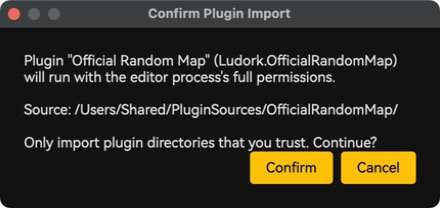
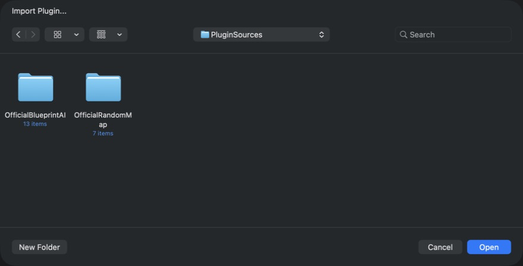
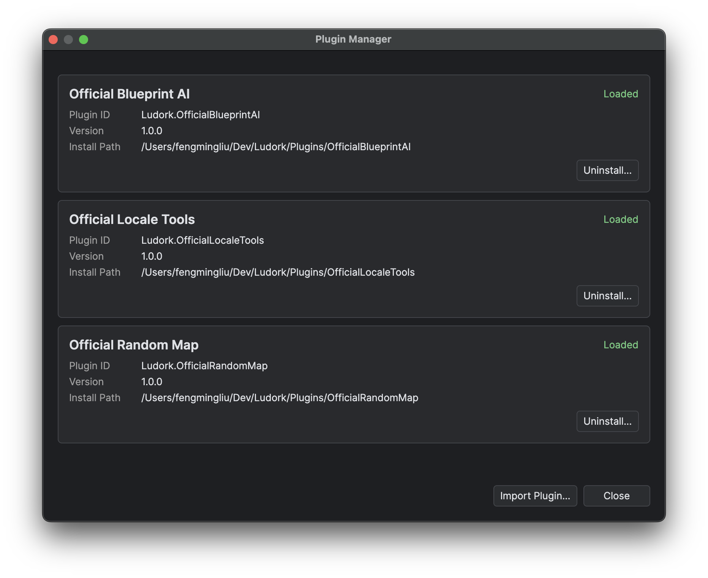

# Installing and Managing Plug-ins

## Goal

Use the official release plug-ins or import, activate, inspect, update and uninstall a third-party source plug-in without confusing its executable files with its retained writable data.

## Prerequisites

- A copy of any plug-in data that must be preserved independently.

Editor plug-ins are trusted code that runs with the editor process's permissions and is not sandboxed. Only import directories you trust.

*Import continues only after the user accepts that the selected source will run with editor-process permissions.*

## Import a third-party plug-in

1. Close work that should not be exposed to the selected code and inspect the plug-in's source, manifest and origin.
2. Choose **Plugins → Import Plugin**, select the complete source directory and accept the trust confirmation.
3. Read the import result. Resolve any manifest or compilation error before continuing.
4. Restart Ludork; imported source is not hot-loaded.
5. Open **Plugins → Manage Plugins** and confirm that the plug-in reports **Loaded**.

*Select the directory containing `plugin.json`, not an individual source file or build output.*

The editor validates the directory and manifest, creates a safe staging copy below the managed plug-in root, dynamically compiles that copy with Roslyn, and validates its entry type. Only then is it moved into place and recorded for the next restart. The selected directory name is preserved. Compilation failures, duplicate IDs, and existing target directories are rejected.

The directory must contain `plugin.json` and at least one participating `.cs` source file. Links, reparse points, embedded `.data`, host-shared DLLs, F#/VB projects, and loose XAML/Avalonia source are rejected before installation. A C# project file may remain for IDE use, but the plug-in compiler does not execute it. Sources below `bin`, `obj`, `.git`, and `.vs` are ignored.

An editor build produced in a repository checkout carries an explicit development marker and uses `./Plugins` as its plug-in root. A published Windows editor uses the editor program directory: source is below `<editor-directory>/Plugins`, and `<editor-directory>/plugins.json` is its registry. A published macOS editor uses `~/Ludork/Plugins`, with its registry at `~/Ludork/plugins.json`. Published outputs omit the development marker even when the publish directory is inside a checkout; Windows does not fall back to or merge with `~/Ludork`.

The Windows editor directory must remain writable because registry updates and `Plugins/.data` are stored there. The per-user MSI location below `%LocalAppData%\Ludork` satisfies this requirement; a portable copy on read-only media does not support plug-in management or writable plug-in data.

## Official release plug-ins

Official Blueprint AI, Official Locale Tools and Official Random Map are distributed together with the editor. The Windows distribution installs all three below its program-directory `Plugins` folder and includes a `plugins.json` generated from their manifests. They are already registered and enabled, so their release installation does not show the third-party trust confirmation.

The macOS DMG keeps plug-ins outside `Ludork.app`. Finder visibly presents `Ludork.app`, an `Applications` link, and **Install Official Plugins**; its `.command` extension and the plug-in payload are hidden. Drag the app to Applications, keep Ludork closed, then double-click the installer. After the user accepts its explicit warning, it validates the hidden payload and transactionally replaces `~/Ludork/Plugins` and `~/Ludork/plugins.json` as one installation.

Do not drag plug-in files to Applications. This macOS operation replaces the complete plug-in installation; it does not merge it. An ordinary failure rolls back to the previous installation; if rollback itself cannot finish, follow the recovery details shown by the installer. Success does not retain a backup and deletes all existing third-party plug-in source, registrations and `Plugins/.data`. Preserve anything needed before selecting **Replace and Install**. The app and installer remain unsigned and unnotarised.

## Restart and status

Import-time compilation prevents invalid source from being registered. At editor startup, every registered plug-in is compiled again from its installed source directory and loaded. Importing, uninstalling, or directly editing plug-in source requires a restart because there is no hot reload. **Plugins → Manage Plugins** reports Loaded, manifest-invalid, compile-failed, initialisation-failed and pending restart/deletion states with diagnostics.

A registered plug-in is enabled on the next startup; there is no hot enable/disable switch. Treat **Loaded** as the effective enabled state.

*Use the status and diagnostics shown here before replacing or removing installed source.*

## Verification

- Exercise each declared command or hook in a disposable project.
- Reopen **Manage Plugins** after restart and check for manifest, compilation or initialisation diagnostics.
- For an update, verify the displayed plug-in version and repeat its smoke tests.
- For an uninstall, restart and confirm that the contribution is absent while retained data remains available if required.

## Data and uninstall

Writable state belongs in `Plugins/.data/<plugin-id>`, exposed as `PluginDataDirectory`. In a repository checkout this is `./Plugins/.data/<plugin-id>`; in a published Windows editor it is `<editor-directory>/Plugins/.data/<plugin-id>`; in a published macOS editor it is `~/Ludork/Plugins/.data/<plugin-id>`. Official Blueprint AI therefore uses `Plugins/.data/Ludork.OfficialBlueprintAI` below the applicable root. Always use `PluginDataDirectory` rather than writing settings or history into the plug-in source directory.

Uninstall unregisters the plug-in and can schedule safe deletion of its installed files. A loaded directory may remain present until restart because its assembly is active. An unregister-only plug-in can be registered again by selecting its existing immediate child directory under the plug-in root. Plug-in data is retained in both uninstall modes; deleting that data is a separate explicit operation. Do not manually edit the registry while the editor is running.

## Limitations

Source compilation can reference the .NET runtime, `Ludork.Plugin.Abstractions`, `Ludork.Plugin.Avalonia`, and the editor's shared Avalonia assemblies. Plug-ins cannot reference editor implementation assemblies.

## Related pages

- [Manifest and Minimal Plug-in](<02.Manifest and Minimal Plug-in.md>)
- [Registration and Hook Reference](<03.Registration and Hook Reference.md>)
- [Testing and Distribution](<09.Testing and Distribution.md>)
