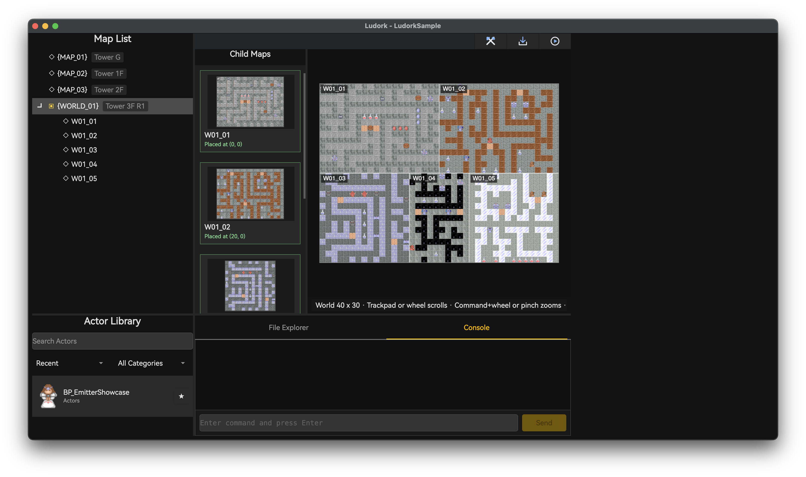

# 图块集、自动图块与地图

## 目标

创建一张地图：图块集已通过校验，图层顺序正确，灯光与 Actor 实例都已摆放。随后保存并运行，不留下无效引用。

## 图块集与自动图块

打开 **数据库 → 图块集数据**（`F7`），定义图块集图片及其图块属性。自动图块数据描述由自动图块源图组合出的动画图块或连接图块。图片放在 `Assets/Tilesets` 或 `Assets/Autotiles`，JSON 定义保存在对应的 `Data` 目录下。

窗口用 **图块集数据** 与 **自动图块** 两个页签分别管理普通定义和自动图块。在列表中选中一个定义并修改名称，再用 **文件名** 旁的浏览按钮，从对应的资产目录里选择源图。

地图调色板的图块集页签显示 `name`，JSON 文件名则是内部 key。改显示名称不影响引用；重命名 key 会更新所有受影响地图的 `layerTileset`，未打开的地图也包括在内，规则与统一的[保存与撤销规则](<01.启动页、工作区与快捷键.md#编辑与保存>)一致。

*在 Passable 模式中，圆圈表示可以通行，叉号表示不可通行。*

*自动图块属性作用于完整的源图，而不是逐格显示出来的每个源单元格。*

绘制之前先核对图块尺寸与源区域。地图做好之后再改图块集定义，可能改变已有图块索引的含义。大幅调整地图尺寸、图层顺序或图块集身份后，应立即测试。

地图 JSON 必须提供 `layerOrder` 字符串数组，它是绘制与 Actor 处理的权威顺序。`layers` 与 `actors` 仍是以这些名称作为键的字典，编辑器会保持数组同步。运行时加载会拒绝缺失、重复或未列入顺序的图层，也绝不会根据 JSON 对象键推断顺序。

普通图块集提供 **通行**、**材质** 与 **四方向** 三种模式。单击左键可切换单个图块的通行属性、打开它的材质编辑器，或切换离点击边最近的那个方向。按住 Shift 拖动左键，会把起点处源图块的属性复制到拖过的每一格。复制什么值由当前模式决定：通行复制布尔值，材质深拷贝完整材质，四方向复制全部四个方向。指针移动稀疏时会自动补齐，一次拖动只算一步撤销。自动图块只有作用于整个资产的 **通行** 与 **材质**，不支持这种批量刷。

*图块面板与当前图层配合使用；所有绘制操作都写入当前图层。*

## 地图列表与组合式大地图

地图列表同时包含普通地图和大地图。大地图行显示 `_world.json` 中的 `worldName`。展开该行后，直接子地图按各自可编辑的 `mapName` 列出，`_world.json` 保持隐藏。**大地图属性** 修改大地图的显示名称，**重命名大地图** 修改目录名与运行时路径。子地图保留普通的 **地图名称** 字段，因此它的文件仍可作为独立地图使用。选中大地图会打开它的拼合面板，右键菜单可创建各类资产。复制子地图会分配全新的 Actor 地图 tag，但不会摆放副本。

把未摆放的子地图拖到大地图画布上即可摆放，拖动已摆放的子地图可以移动位置。按 Delete、Backspace 或使用摆放项的右键菜单都能移除它。每次摆放编辑都是一步撤销/重做；出现重叠、越界或图层顺序冲突时会被拒绝。

*子地图缩略图显示摆放坐标，右侧画布预览各地图的拼接结果。*

子地图数据与预览图片逐步加载，画布和缩略图会在各子地图就绪后自动更新，首次打开大地图也无需切换地图来补齐画面。缺失或不可读的子地图不会阻止其他地图加载。地图编辑、撤销/重做与图片变化会刷新受影响的预览。

画布可以滚动或平移。Windows/Linux 用 Ctrl+滚轮缩放，macOS 用 Command+滚轮或捏合手势缩放。只读预览显示图块、自动图块的第一帧，以及时间零点处的静态 Actor 图像。它不播放 Actor 动画，也不渲染灯光、雾、远景或地图图层 shader。

校验覆盖清单、扁平的目录结构、直接 JSON 地图、摆放、图层顺序以及整个大地图内 Actor tag 的唯一性。非 JSON 的普通文件会被忽略。会让摆放失效的尺寸调整会被直接拒绝，不会去移动或裁切摆放。删除已摆放的子地图文件之前，先移除它的摆放并保存，否则清单中的引用会阻止删除。

重命名会更新 [项目设置与资产布局](<02.项目设置与资产布局.md>) 中列出的可识别引用。大地图清单与子地图各自维护历史，自动引用更新、摆放与图层顺序修正都会形成撤销屏障。文件浏览器保持 `Data/Maps` 的层级关系，根地图、大地图目录与子地图不能在层级之间或大地图之间移动，创建和删除都要通过地图列表完成。

*开始制作图层前，先核对地图尺寸与环境光。环境光按钮同时显示颜色色块与 ARGB 值，棋盘背景表示透明度；点击按钮即可选择颜色。*

地图属性还可以从 `Assets/Panoramas` 选择一张可选的 **远景** 图片。运行时按 Cover 方式缩放该图以铺满 `GameMap.MapViewRect`，再以摄像机位置在地图可滚动范围中的比例裁剪溢出部分：地图左边缘对应远景左侧，右边缘对应远景右侧；某个轴无法滚动时，取该轴溢出部分的中心。环境光会给图片着色，点光源则不会。路径留空即关闭远景。大地图清单可以设置覆盖世界摄像机的全局远景，子地图的 `panorama` 只在该子地图作为独立地图加载时生效。

## 图层与绘制

图块模式支持新建、重命名、排序、复制、粘贴和删除图层。图层可以指定 shader。选中某个图块集页签会立即改变活动图层的图块集，图层中已有的图块索引随后按该图块集解释。在调色板里选择图块或自动图块，在活动图层上绘制，需要移除时使用擦除。缩放与平移不会修改地图数据。

每个图层页签左侧显示图层名，右侧是显隐开关。显隐状态属于编辑器产出的地图数据，因此隐藏的图层不会被渲染，并且处于只读状态。图层及其 Actor 始终按照地图的图层顺序绘制。**全貌** 显示全部可见图层；选中某个图层只会淡化其他图层，不会改变它们的前后顺序。

地图只有一种图块画笔。按住左键拖动可连续绘制所选图块或自动图块，Shift+左键拖动绘制实心矩形，右键单击可取样所点格子。Alt+左键单击（macOS 为 Option+左键单击）填充与起点普通图块及自动图块值相同的四方向连通区域。选中多格图块时，以点击格为起点重复铺设所选图案；自动图块与擦除使用同一填充快捷键。一次笔画、矩形或填充只记为一次地图编辑，对应一步撤销。隐藏图层会拒绝所有编辑入口，并给出只读提示。

笔画进行中保存，之后的移动会开始新的一步撤销。撤销与重做会结束当前笔画，再次按下鼠标即可继续绘制。

## 灯光与 Actor

切换到光源模式即可放置并编辑灯光，包括灯光的位置、颜色与半径。切换到角色模式即可放置蓝图实例、移动实例，并编辑它对外公开的属性。选中的实例可以覆盖类默认值，而不改动蓝图本身。

项目编辑时，按住 Ctrl（Windows/Linux）或 Command（macOS）左键拖动 Actor，会选中它并按地图像素连续调整 translation，不改变格子坐标。Alt/Option＋左键拖动仅调整本地坐标中的 origin，换算时计入旋转和缩放；translation 保持不变，因此图像向拖动的相反方向偏移。同时按下两种修饰键时，Alt/Option 优先。存在零缩放轴时不能拖动 origin。这些操作写入实例的 `defaultTranslation` 和 `defaultOrigin` 覆盖值。

Ctrl/Command＋滚轮，或 macOS 的 Command＋触控板捏合，在角色模式调整已选中 Actor 的 scale，在光源模式调整已选中光源的半径。Actor 缩放写入 `defaultScale`，保持两轴比例和符号，零分量也保持不变。每单位滚轮增量乘以 1.1，捏合则连续调整。该快捷键将半径限制为至少一个地图像素，零半径固定灯可从一个像素开始增大。没有符合条件的可编辑选中对象时，继续缩放地图；不按修饰键的捏合仍缩放地图。这些属性快捷键不适用于实时调试。

角色模式下，Alt/Option＋滚轮或 Option＋触控板捏合调整已选中 Actor 的 `defaultRotation` 实例覆盖值。滚轮正向增量和触控板放大为顺时针，反向增量和缩小为逆时针。每单位滚轮增量增加 15°，每 0.1 捏合增量增加 18°。同时按住 Ctrl/Command 时，Alt/Option 旋转优先。没有符合条件的可编辑 Actor 时，这些手势保留原有视图操作。

每次属性拖动对应一步撤销。同一对象、同一属性的连续滚轮或捏合操作合并，空闲 300 毫秒后结束。切换选择、地图、图层、模式或离开编辑器焦点也会结束手势。保存后继续输入会开始新的撤销步骤；撤销、重做会结束当前交互。预览与属性面板同步更新。

光源模式还会用彩色填充和灰色虚线轮廓显示已放置 Actor 的 `lightComp` 范围。范围读取继承默认值和实例覆盖值，随 Actor 编辑及撤销、重做刷新。图层栏右侧的**可选中 Actor**默认关闭，只在当前编辑器窗口内保留状态。关闭时不能切换图层，Actor 范围仅供查看；开启后恢复此前图层，该层已不存在时回到总览；恢复的隐藏图层仍保持只读。此时可点击当前可编辑图层中带光源 Actor 的图像或光圈进行选择。总览与隐藏图层不允许选择，普通无光源 Actor 也不参与此模式的选择。

选中的 Actor 光圈会高亮，右侧显示 **Actor Info**，不显示 Actor 列表。可在其中修改包含 `lightComp` 在内的实例属性，仍保存为地图实例覆盖值。开启**可选中 Actor**后，Ctrl/Command＋滚轮或 Command＋捏合调整已选中 Actor 的 `lightComp.lightRadius`，保留灯光的其他配置；角色模式下同一快捷键仍调整 Actor 的 scale。拖动图像或光圈时，Actor 与灯光一起按整格移动，保留鼠标按下位置的相对偏移和组件的灯光偏移，一次拖动对应一步撤销。Actor 光圈没有独立的半径拖动或 Delete 删除操作。切换图层、关闭开关或 Actor 不再显示光源时会清除选择。

重叠时优先命中符合条件的 Actor 图像，其次是已选中固定灯的半径操作柄；其余按发光点距离选择，距离相同时选择绘制在上方的对象。固定灯保留自由移动、半径编辑与删除行为。不可见 Actor、隐藏图层以及半径不大于零的组件不显示范围。这是范围预览，不渲染运行时光照和阴影；大地图拼接预览与实时调试不增加这些范围。

普通地图与大地图预览会把最终解析出的 `visible` 为 `false` 的 Actor 以 25% 不透明度绘制，继承默认值与实例覆盖值都计入解析结果。贴图自身的 alpha，以及普通地图上非当前图层的 50% 淡化，仍会与该不透明度叠乘。选中轮廓和错误标记保持清晰，Actor 也仍可选中、可移动。隐藏图层依旧不可见，摆放预览与缺图占位符保持原有外观。这只是编辑器提供的预览辅助；运行时不可见的 Actor 依旧不显示。

*光源模式在地图上显示所选发光体及其半径范围。*

*角色模式修改已放置的蓝图实例，不改变类默认值。*

Actor 灯光的 `LightComponent.lightOffset` 以 Actor 本地包围盒的中心为基准。完整的 Actor transform 会作用于该偏移，因此发光点随旋转和缩放移动。配置墙面火把时，把偏移设在房间一侧实际可见的火焰位置；渲染器不会把发光点挪到附近可通行的格子上。

编辑器也会显示无贴图 Actor 的灯光范围。Actor 缩放会改变发光点的位置，但圆形范围始终使用以地图像素为单位的 `lightRadius`，仅随编辑器视图缩放。

`Material.lightBlock` 是光每穿透一个 `CellSize` 时的不透明度，取值范围为闭区间 `[0, 1]`。`0` 完全透光，`1` 完全阻断直射光，中间值按实际穿过的路径长度复合。例如取 `0.5` 时，光穿过半格、一格、两格后的透射率分别约为 `0.707`、`0.5` 和 `0.25`。

发光 Actor 只会从它自己灯光的动态遮挡体中排除。它仍然遮挡其他所有灯光，同一位置上的图块与其他 Actor 也依然是遮挡体。不要把墙体和它的火把发光体合并成同一个 Actor。墙体遮挡 Actor 与火把 Actor 要分开使用，因为排除发光体的同时也会把墙体排除掉。

### 大地图中的 Actor tag

在大地图的子地图里新建或粘贴 Actor 时，默认 tag 会以子地图文件名（去掉扩展名）作为前缀，编辑器还在整个大地图范围内强制唯一。子地图或大地图重命名不会改写已有 tag 或自定义 tag。复制子地图时，副本的 tag 会改写为 `<new-child-stem>.<old-tag-body>`，并同步更新匹配的 `BPClassVarChanged` key。

## 地图目标

`startMap` 文件字段与蓝图 Transfer 选择器使用同一棵地图树。选中大地图时保存 `<WorldFolder>/_world.json`，position 是大地图格子坐标。选中已摆放的子地图时保存 `<WorldFolder>/<ChildFile>.json`，position 相对该子地图，运行时再换算为大地图坐标。未摆放的子地图仍会出现在树里，但不能选作运行时目标。

## 实时调试

在 **独立窗口** 中运行并启用 [实时调试](<08.运行、调试与打包.md#实时调试>) 时，地图面板显示玩家所在的普通地图或大地图子地图。允许的图块与 Actor 操作，以及存档边界，见该页。

## 限制

任意字符串、自定义协议和动态拼接的路径不会被改写。移动图块集同样不会修复玩法中用到的字符串。

## 相关页面

- [项目设置与资产布局](<02.项目设置与资产布局.md>)
- [运行、调试与打包](<08.运行、调试与打包.md>)
- [蓝图、公共函数与 Actor](<04.蓝图、公共函数与 Actor.md>)
- [新游戏、标题与场景流程](<../03.Lua 与蓝图脚本/05.Game 玩法/02.新游戏、标题与场景流程.md>)
- [Official Random Map](<../05.插件开发与安装/07.Official Random Map.md>)
