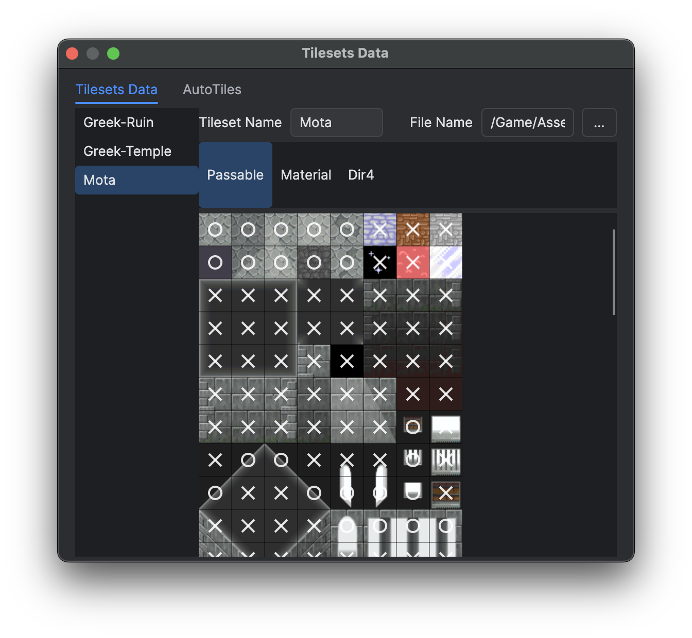
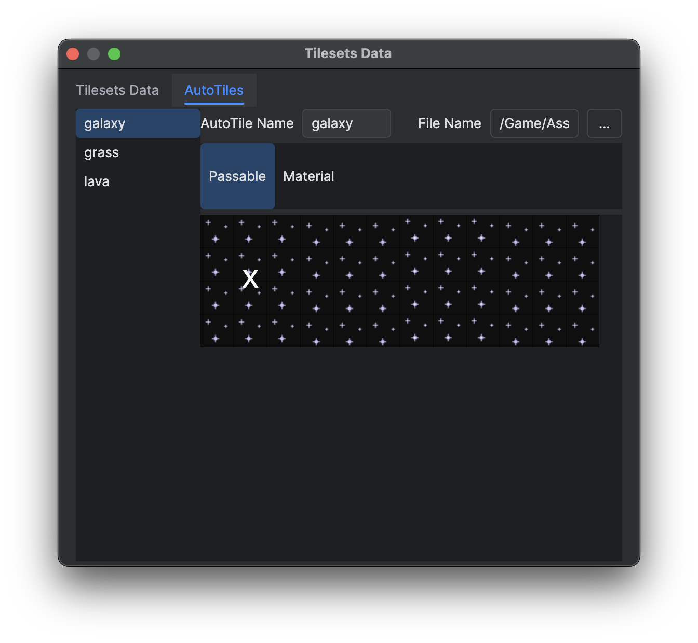
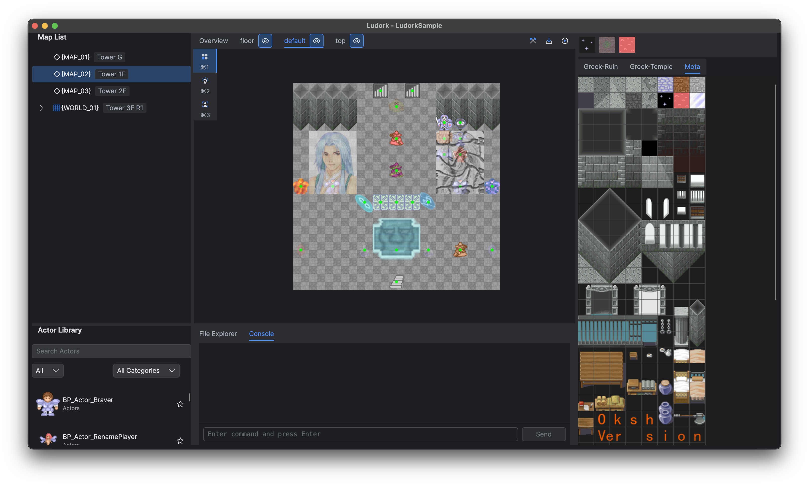
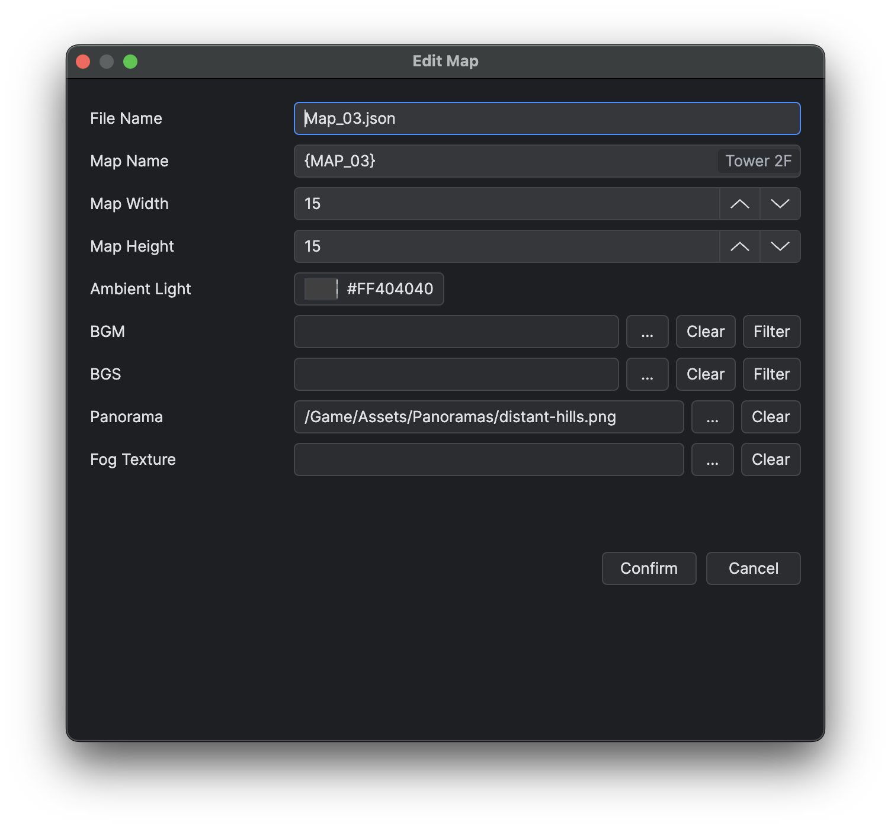
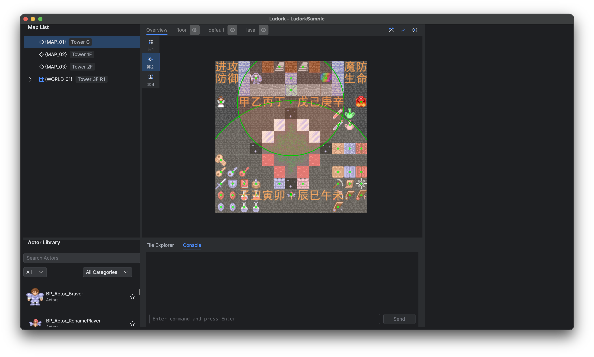
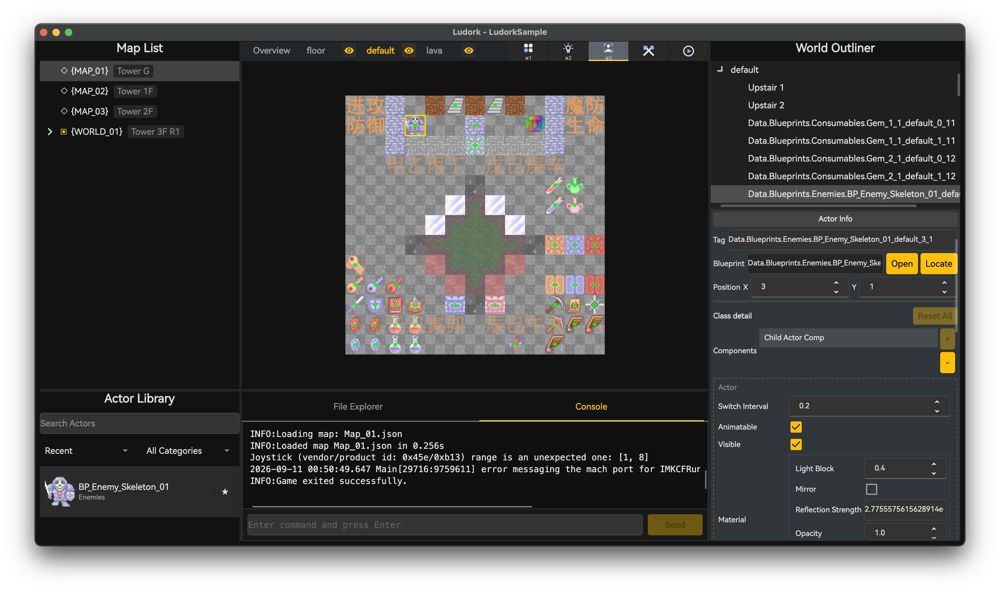

# Tileset、Autotile 与地图

## 目标

使用已验证 tileset、顺序正确的图层、灯光和已放置 Actor 实例创建地图，然后在没有无效引用的情况下保存并运行。

## Tileset 与 Autotile

使用 **数据库 → 图块集数据**（F6）定义 tileset 图片及其图块属性。Autotile 数据描述由 autotile 源图组合出的动画或连接图块。图片应放在 `Assets/Tilesets` 或 `Assets/Autotiles`，JSON 定义保存在对应的 `Data` 目录。

窗口通过 **Tilesets Data** 与 **AutoTiles** 两个页签分别管理普通定义和 Autotile。先在左侧列表选择定义，再修改名称，并使用 **File Name** 旁的浏览按钮从对应资源目录选择源图片。

*在 Passable 模式中，圆圈表示可以通行，叉号表示不可通行。*

*Autotile 属性作用于完整源图，而不是显示出的每个源单元格。*

绘制前先确认图块尺寸和源区域。地图制作完成后再改变 tileset 定义，可能改变现有图块索引的含义。大幅修改地图尺寸、图层顺序或 tileset 后应立即测试。

普通 Tileset 提供 **Passable**、**Material** 与 **Dir4** 模式。鼠标左键单击会切换单个图块的通行属性、打开其材质编辑器，或切换距离点击位置最近的边所对应的方向。Shift+鼠标左键拖动会把按下位置的源图块属性复制到经过的所有单元格。当前模式决定复制内容：Passable 复制布尔值，Material 深拷贝完整材质，Dir4 复制全部四个方向。稀疏鼠标事件之间会自动补齐，一次拖动只形成一步 Undo。Autotile 只提供作用于整套资源的 **Passable** 和 **Material**，不提供该批量刷。

*图块面板与当前图层配合使用；所有绘制操作都会写入当前图层。*

## 地图列表

通过地图列表右键菜单新建、编辑、复制、粘贴或删除地图。地图属性包括尺寸、tileset、音频、雾和环境光。重命名地图会改变数据路径，但不会保证自动改写所有玩法引用。

*制作图层前，请先核对地图尺寸和所选 tileset。*

## 图层与绘制

图块模式支持图层新建、重命名、排序、复制、粘贴和删除；图层可指定 shader。选择 tileset 页签会立即修改活动图层的 tileset，图层中已有的图块索引随后按该 tileset 解释。在调色板选择普通图块或 autotile，在活动图层绘制，并使用擦除工具删除。缩放和平移不会修改地图数据。

每个图层标签左侧显示名称，右侧提供显隐按钮。显隐状态属于地图数据；隐藏图层不会渲染，并且为只读状态。

地图只使用一种图块画笔：鼠标左键拖动连续绘制所选图块或 autotile，Shift+鼠标左键拖动绘制实心矩形，鼠标右键点击取样目标单元格。一次画笔笔画或矩形只形成一次地图编辑与一步 Undo。隐藏图层会拒绝所有编辑入口，并显示只读提示。

## Light 与 Actor

切换到 Light 模式放置和编辑灯光，包括位置、颜色和半径。切换到 Actor 模式放置 Blueprint 实例、移动实例并编辑公开属性。实例可以覆盖类默认值，而不会修改 Blueprint 本身。

*Light 模式在地图上显示所选发光体及其半径范围。*

*Actor 模式修改已放置的 Blueprint 实例，不改变类默认值。*

Actor 灯光的 `LightComponent.lightOffset` 以 Actor 本地包围盒中心为基准，并应用完整的 Actor transform，因此发光点会跟随旋转和缩放。配置墙面火把时，应把 offset 放在房间一侧可见火焰的实际位置；渲染器不会把发光点自动移动到附近的可通行格。

`Material.lightBlock` 表示穿过一个 `CellSize` 厚度时的遮光率，合法范围为 `[0, 1]`。`0` 完全透光，`1` 完全阻断直射光，中间值会按实际穿透长度复合。例如 `0.5` 穿过半格、一格和两格时，透射率分别约为 `0.707`、`0.5` 和 `0.25`。

发光 Actor 只会从自身灯光的动态遮挡体中排除；它仍会遮挡其他灯光，同位置的 Tile 和其他 Actor 也不会被豁免。墙体和火把发光体不得合并为同一个 Actor，应分别使用墙体遮挡 Actor 与火把 Actor，否则排除发光体时也会一并排除墙体。

## 限制

重命名地图或移动 tileset 不保证改写基于字符串的玩法引用。

## 相关页面

- [项目设置与资产布局](<02.项目设置与资产布局.md>)
- [蓝图、Common Function 与 Actor](<04.蓝图、Common Function 与 Actor.md>)
- [Official Random Map](<../05.插件开发与安装/07.Official Random Map.md>)
