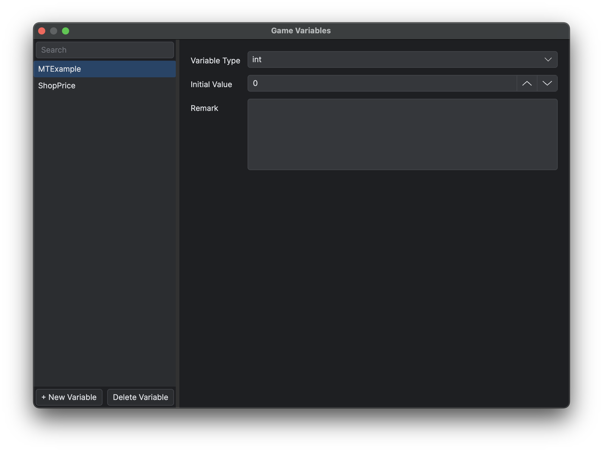

# General Data

General Data 是编辑器管理的 `Data/General` 数据库。每个 JSON 文件定义一个类型 schema 和一组命名成员，适合保存被多个地图或 Blueprint 共用的敌人、物品、装备、玩家预设、状态等数据。

## 目标

定义可复用数据 schema、录入经过校验的 member，并创建 Text Config，同时不破坏已有 runtime 引用。

## 类型结构

| 键 | 含义 |
|---|---|
| `params` | 有序字段定义，包含 `type`、`defaultValue`、可选 `comment`、容器必需的 `itemType`/`valueType` 和引用选择器 |
| `members` | 保存字段值的命名记录 |
| `events` | 可选的有序事件名；每个成员可以保存独立的对应 graph |

支持的字段包括 string、bool、int、float、file、list、dict，以及 `sf.Vector2f/i/u`、`sf.Vector3f/i/u`、`sf.Color` 和 `sf.IntRect`。list 必须声明 `itemType`，以 string 为 key 的 dict 必须声明 `valueType`。容器可用 `any` 保存异构 JSON 值，但不能嵌套。缺少子类型、member 字段缺失或存在未知的非下划线字段，以及值不符合 schema 时，加载会直接失败。SFML array 在此构造；`any` 保留 JSON literal 类型且不执行字符串。运行时直接使用加载后的 typed member。

`linkedType` 已不受支持，出现时直接报错。

每个字段定义都可以保存可选的英文 `comment`。新增或编辑字段时通过 **注释** 填写；空注释不会写入。Form 字段名和 Table 表头会在悬停时显示该注释。这个 schema 注释与恰好名为 `desc` 的 member 业务字段值不是同一内容，并且只是项目中的普通文本，不是 locale key。

reference 声明可以把 string 值限定到另一个 General Data 类型、animation 或其他受支持资源。list reference 作用于 string item，dict reference 作用于 string key。空引用显示为 **— 不选择 —**，JSON 中仍保存空字符串。新增带 reference 的 dict 行时，在选中真实 key 前只保留待选 UI，不会保存 `key` 等占位键。

## 步骤

1. 打开 **数据库 → 通用数据**（F9）。
2. 选择或创建类型。
3. 在大量创建成员前先定义字段；在 Form 中右键点击字段名可编辑字段定义。
4. 添加成员并填写字段值。
5. 从 type 右键菜单管理事件，再通过**编辑 Ability Graph**打开 member graph。重命名或删除事件会更新全部 member graph；runtime 必须显式激活它们。
6. 重命名或删除类型/成员前查看引用。
7. 保存，并实际运行读取该数据的路径。

保存时会重新生成 `Source.Configs.GeneralEnum` 与 `Source.Configs.GeneralDataTypes` 的 runtime/LuaLS 文件。`GeneralEnum` 包含有序 type/member 常量；`GeneralDataTypes` 定义各 `<TypeName>AttributeSet` 及 `Create(typeName, memberID, memberData)`，用于复制 typed member 与 ID。不得手工编辑生成文件。

编辑字段时可以修改名称、类型、容器元素/值类型、默认值和注释。重命名字段会保留每个 member 的现有字段值。修改字段类型、list 的元素类型或 dict 的值类型时，编辑器会先请求确认；确认后才会用新默认值重置所有已有 member 的该字段值。仅修改默认值不会覆盖已有 member。删除字段会移除其含义，但不会自动修复读取该字段的脚本。

## 搜索与视图

成员搜索不区分大小写，会匹配成员 ID，以及名称、数字、布尔值等直接标量值；不会递归搜索 list、dict、tuple 或 graph 内容。General Data 窗口保持打开期间，每种数据类型会保留自己的搜索内容、选中成员和 Form/Table 选择，Undo 或 Redo 重建页面后也会恢复；这些会话状态不会写入项目。

Form 为单个成员提供完整编辑器。Table 按 schema 声明顺序显示 ID 与字段，并可直接编辑 bool、int、float 和 string；带 reference 的 string 仍使用 selector。file、list、dict、tuple 与未知结构字段只显示摘要和 **编辑** 按钮；点击后会选中对应成员并返回 Form，避免把结构化 JSON 替换为显示字符串。Table 行使用纵向虚拟化，固定宽度的列可横向滚动。

同一字段获得焦点期间的连续文本和数字修改形成一个 Undo 步骤。复选框、selector、成员操作和 schema 操作仍各自形成独立步骤。保存、Undo 与 Redo 会先切分当前焦点编辑，之后继续输入会开始新的步骤。

*先定义 schema，再录入记录，确保所有 member 使用预期字段类型。*

## Game Variable Manager

打开 **数据库 → 游戏变量**（F8），声明由 Blueprint 与当前游戏实例共享的可变值。左侧列出已声明的变量名；选中一项后，可在右侧编辑类型、初始值和可选备注。备注只供编辑器查看，不影响运行时。变量名是运行时标识符，因此 graph、地图或脚本开始引用后应保持稳定。

搜索框按变量名进行不区分大小写的过滤。**新建变量**会在输入名称并选择类型后添加声明；**删除变量**会在确认后移除当前选中的声明。

*在右侧详情区修改当前声明的类型、初始值和仅供编辑器查看的备注。*

创建变量时必须选择类型。Manager 提供 `bool`、`int`、`float`、`string`、`list` 与 `dict`，写入 metadata 时分别映射为 `bool`、`int`、`float`、`string`、`any[]` 与 `Dict[string, any]`。list 与 dict 使用普通 Lua table，而不是 Standard 的原生 `list` 或 `dict`。修改已有变量的类型会清空初始值，并替换成新类型的空默认值。

打开 Manager 会在需要时创建 `Scripts/Source/Configs/GameVariables.lua` 与 `GameVariables_meta.lua`，每次成功修改都会重新生成这一对文件。runtime 文件把每个名称映射到其初始值；metadata 文件保存有序名称、声明类型，并且只在备注非空时写入 `Meta.Remark`。两个文件都是生成输出，均带有“不得手工修改”的警告。

带 `InstVar` 的 Blueprint 字段或节点参数使用可搜索选择器，而不是自由输入文本框。对应的 `InstVarValue` 字段会读取已选声明的类型，并切换为该类型的通用编辑器。带类型过滤的选择器（例如 Sample 条件门）只列兼容变量。

## Text Config

普通 UI 文本直接在 UI 节点上设置样式。仅为共享、特殊文本或富文本标签样式使用 **游戏 → 新建文字配置**。已引用的 key 应保持稳定，改变 schema 后需验证运行时读取。

*Text Config 为项目使用的结构化文本数据提供专用编辑界面。*

General Data 会原样保留每个 string。string 字段不会自动本地化，因为同一字段类型还用于 class、animation、装备槽位等语义标识符。类似 `{ITEM_NAME}` 的花括号显示值只应在展示边界传给 `LOC`，长生命周期 UI 响应语言变化时应重新解析。Catalogue 格式与 runtime formatter 见[游戏本地化工作流](<../05.插件开发与安装/06.游戏本地化工作流.md>)。

`Source.Gameplay.GeneralDataGraphAbility` 使用 `GameplayEventData` context 显式激活 member graph。Graph 不提供伪 parent/self 节点；使用全局节点与该 context。`null` start 返回 `NoGraph`；graph 必须同步执行，禁止 latent node，错误直接传播。

纯 graph 编辑器从 type 的 `events` 读取事件列表，不提供 class attribute 或 Blueprint 继承。项目保存会拒绝未声明事件和 latent node。

Sample 的精确 schema 参见“General Data 参考”。

## 限制

修改 schema 或游戏变量声明不能自动修复脚本、graph、存档或字符串引用。General Data 与生成的游戏变量声明属于项目定义数据，不用于保存可变游戏会话状态。

## 相关页面

- [General Data 参考](<09.General Data 参考/01.Class.md>)
- [蓝图、Common Function 与 Actor](<04.蓝图、Common Function 与 Actor.md>)
- [游戏本地化工作流](<../05.插件开发与安装/06.游戏本地化工作流.md>)
