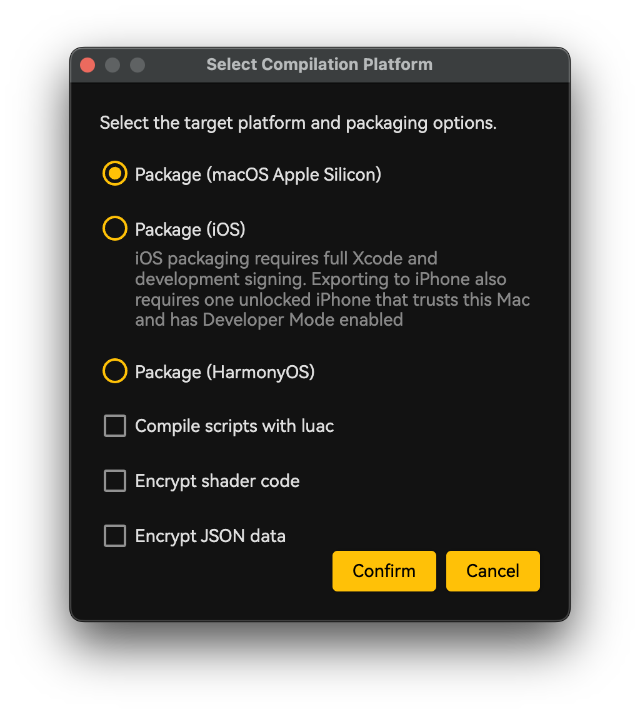

# 运行、测试与打包

## 目标

在具有可操作诊断的情况下运行项目，测试原生可执行文件，并为受支持目标生成完整发行包。

## 运行模式

Play 控件按选择的开发模式启动项目。**Individual Window** 使用独立游戏窗口；嵌入模式在 Windows 上把 runtime 托管在编辑器内，不支持的平台使用适用的独立行为。修改原生二进制前应先停止当前进程。

编辑器会先执行 before-run 插件 hook，在需要时构建 C++ 目标，使用编辑器启动参数运行 runtime，并建立命令通道。hook、构建或协议握手失败都会显示在 Console。

## 测试层次

- 保存前校验已修改 Blueprint。
- 在编辑器中运行地图，并保持 Console 可见。
- 使用 Performance Monitor 检查主帧与逻辑耗时。
- 在编辑器外运行原生可执行文件，发现工作目录假设。
- 测试最终打包产物，因为其可写设置目录和资源布局与编辑器模式不同。

## 打包

选择 **文件 → 打包项目**，选择目标并查看打包日志。项目必须有合法入口脚本和兼容模板。打包前，把 `Scripts/Entry.lua` 中 Sample 的 `APP_NAME = "LudorkSample"` 改成游戏专用名称；打包脚本会拒绝默认值。Official Locale Tools 通过 before-pack hook 导出 `Locale.xlsx`；底层打包脚本本身不会执行该导出。

*开始 Pack 前，核对目标、输出位置和可选部署设置。*

桌面包会复制 runtime 文件、`Assets`、`Data` 和运行时 `Scripts`。打包前会删除仅用于开发的 `Scripts/stub`，`.d.lua` 不会交给 `luac`，最终化阶段会拒绝 stub 目录外任何残留声明文件。启用 FFmpeg 的 Windows 与 macOS 包还会携带对应共享库或动态库、声明和源代码提供材料。macOS 的签名与公证由发行者负责。

不提供 Standalone iOS 模板。在 macOS 上选择 iOS 15.0 或更高版本目标时，需要 C++ Source 项目、完整 Xcode 和可用的 Apple Development 开发签名。C++ Source + FFmpeg 的 iOS 构建使用 `Sample/cmake/FFmpeg` 生成的静态 `.a` 库，而不是桌面端的共享库方案。下游发行者分发该静态链接 iOS 应用时，必须满足适用的 LGPL 重链接材料要求，并在发行前查阅 `Licenses/FFmpeg/README.md`。

iOS 打包默认只生成 `dist/<游戏名>.ipa`，无需连接 iPhone。勾选“是否导出到iPhone”后，打包器还会把应用安装到设备并自动启动；此模式要求只连接一台可用的 iPhone，且设备已解锁、信任此 Mac 并启用开发者模式。

HarmonyOS 打包需要 C++ Source 项目、Apple Silicon macOS，以及包含 OpenHarmony native SDK 的 DevEco Studio。所有 HarmonyOS 变体的 HAP 兼容级别与原生 deployment target 均为 HarmonyOS 6.0.2 / API 22。选择 **Mobile** 使用 OpenGL ES 手机/平板宿主；选择 **2in1** 后会显示图形后端选项，默认为 OpenGL，也可选择 OpenGL ES。

不导出到设备时，打包器会在 `dist` 中生成一个 arm64-v8a 未签名 HAP：`<游戏名>-harmony-mobile-unsigned.hap`、`<游戏名>-harmony-2in1-opengl-unsigned.hap` 或 `<游戏名>-harmony-2in1-opengl-es-unsigned.hap`。勾选**导出到匹配的 HarmonyOS 设备**后，会改为生成对应的 `-signed.hap`，将其安装到设备并启动游戏。Mobile 导出接受报告为 `default`、`phone` 或 `tablet` 的已连接设备；2in1 导出只接受报告为 `2in1` 的设备。必须恰好有一台已连接设备匹配所选形态，但另一形态的设备可以保持连接。签名、安装和启动前，打包器会再次校验设备形态与身份。

2in1 OpenGL 包要求设备镜像通过 `libGLv4.so` 提供 HarmonyOS 桌面 OpenGL。部分 API 24 PC 模拟器镜像没有该运行时，即使本机编译 SDK 提供了 OpenGL 导入库也是如此。在这种镜像上，应用会明确显示原生 OpenGL 模块不可用，不会静默切换到 OpenGL ES。请为该镜像单独导出 OpenGL ES 包，或在提供桌面 OpenGL 运行时与能力查询的 2in1 设备/镜像上验证 OpenGL 包。

C++ Source + FFmpeg 的 HarmonyOS 构建会静态链接面向 API 22 的 FFmpeg 构建，并携带工程运行时法律材料；下游发行必须满足 `Licenses/FFmpeg/README.md` 所述的适用 LGPL 声明与重链接材料要求。`Licenses` 与根许可证/声明文件不是 HAP 格式前置条件：存在时打包器会包含它们，缺失时不会拒绝项目。

仅当 macOS 上的 C++ Source 项目检测到 Android Studio 安装于 `/Applications` 或当前用户的 `Applications` 目录时，才显示 Android 打包。它需要 SDK Platform 36、Build Tools 36.0.0、本机 SDK 下完整稳定版 NDK r27 或更高版本工具链，以及本机 CMake 3.28 或更高版本。打包器只从该 SDK 的 `ndk` 目录选择满足要求的最高版本；项目与编辑器发行包都不会携带 SDK 或 NDK。打包器先使用本机 CMake 与选定 toolchain，再使用 Android Studio 内置 JBR 和 Gradle。APK 最低为 API 24，因此覆盖 Android 12 与 12L。它还把应用标记为游戏、请求由传感器选择方向的横屏，因此左右两个横屏方向都受支持。Android 打包不会调用 SDK Manager、AVD 或 `adb`，无论是否签名都不会安装或启动 APK。

选择 Android 后会显示**签名 APK**，默认不勾选。不勾选时发布 `dist/<游戏名>-android-arm64-v8a-unsigned.apk`。勾选并确认 Pack Options 后会打开签名窗口；请选择已有且可读的 JKS 或 PKCS12 keystore，并填写其 Key alias 与 Keystore 密码。**Key 密码与 Keystore 密码相同**默认勾选；只有 Key 使用独立密码时才取消勾选并填写 Key 密码。取消签名窗口会返回 Pack Options，不会开始打包。签名流程先构建并校验未签名 APK，再使用 Android SDK `apksigner` 签名并复验；成功时只发布 `dist/<游戏名>-android-arm64-v8a-signed.apk`，未签名 APK 仅保留为构建中间数据。

Keystore 路径、alias 与密码只在本次 Pack 操作中使用。Ludork 不会把它们保存到项目、编辑器设置、Gradle 文件、日志或系统钥匙串。请妥善保管 keystore 及其凭据：要让后续版本更新同一已安装应用，必须复用相同签名密钥。

Android 资源只执行一次最终化，以带 SHA-256 manifest 的 APK assets 形式保存，并在原生启动前复制到版本化内部 runtime 目录。`Licenses` 与根许可证/声明文件不是 APK 格式前置条件：存在时打包器会包含它们，缺失时不会拒绝项目。生成工程初始携带的是 Sample 游戏运行时法律材料集，而不是编辑器法律材料集。启用 FFmpeg 的 Android 项目会静态链接裁剪后的 FFmpeg 库；这种可选打包行为不会免除发行者履行 `Licenses/FFmpeg/README.md` 所述 LGPL 声明与重链接材料义务。

## 失败排查

Run 或 Pack 停止时，先阅读 Console 或打包日志中的第一个可执行错误。依次检查插件 hook、`Main.proj`、入口脚本、JSON 语法、Blueprint 校验、生成的原生模块和缺失资源。Android 签名失败时，还要确认 keystore 路径为绝对路径、文件仍可读、alias 存在且两个密码与所选 key 匹配；凭据不会跨 Pack 操作保留，因此需要重新填写。打包不能修复无效项目引用，也不能替代目标平台测试。

## 相关页面

- [项目模板](<../01.快速入门/02.项目模板.md>)
- [测试与分发](<../05.插件开发与安装/09.测试与分发.md>)
- [脚本 Mixin 校验与打包](<../03.Lua 与蓝图脚本/03.脚本 Mixin/05.校验与打包.md>)
