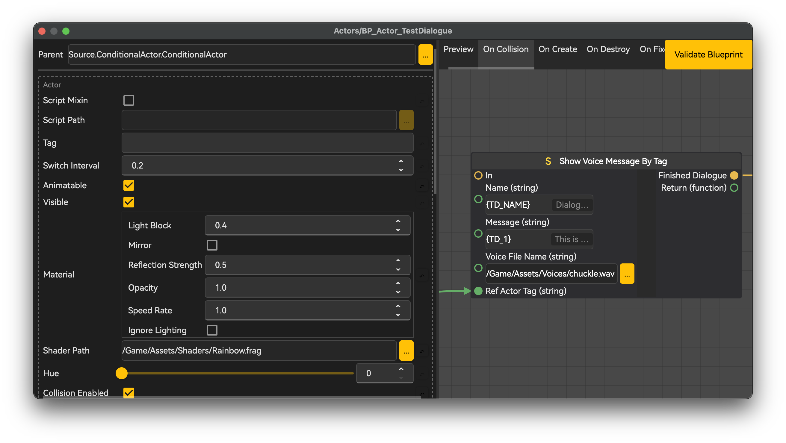
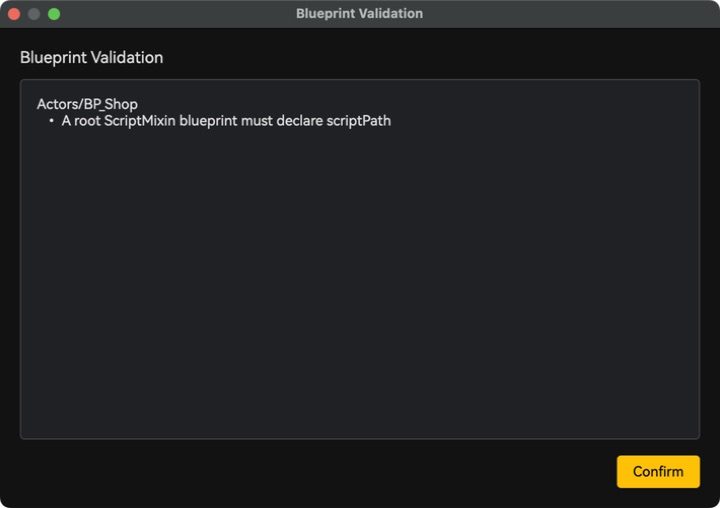

# Blueprint 脚本

Blueprint 将类默认值与可视化图保存在 `Data/Blueprints`。Common Function 保存可复用图。两者均根据当前项目 metadata catalogue 校验。

## 页面

- [执行流、事件与变量](<01.执行流、事件与变量.md>)介绍入口事件、执行/数据 pin、Common Function 与默认值。
- [Metadata 结构与 Decorator](<02.Metadata 结构与 Decorator.md>)定义用于生成字段和节点的纯数据声明。

## 工作流

按 F3 创建 Blueprint，选择有效父类，添加受支持的事件入口，连接执行与数据 pin，然后校验并保存。多个图需要相同操作时，按 F10 打开 Common Functions。Script Mixin Blueprint 遵循独立的 [Script Mixin](<../03.脚本 Mixin/00.概述.md>)契约，不执行其图。

*图通过执行 pin 表达执行顺序，通过类型化数据 pin 传递值。*

*校验会指出普通保存前必须修正的 class、graph、node、link 或 pin。*
